# WIFI Adapters for Penetration Testing with Kali Linux

This is a collection of wifi adapters I've successfully used with Kali Linux for penetration testing. Excluded are any adapters that do not support monitor mode and packet injection. So long as your Kali distribution is up to date, most these adapters should work for you out of the box***.

### List of Compatible Adapters

* TP-LINK TL-WN722N
* Panda Wireless PAU05
* Panda Wireless PAU07
* Panda Wireless PAU09
* Alfa Networks AWUS036ACH
* Fenvi RTL8812AU (X001LNJ6PB)
* Fenvi RTL8811AU (X001LNJXOP)

### Notes on testing and compatibility:

These were tested for compatibility, functionality, and performance on a Macbook Pro (late 2014) running a live boot of Kali 2019 1. Panda Wireless have stated to me directly in email correspondence that there may be compatibility issues when running these devices on virtual machines. 

Reception was assessed using `nmcli dev wifi` after allowing the device to connect and run for 30 seconds. In some cases, a 5' USB extension was used to move the adapter to a location that was less obscured by desk clutter and interference from monitors.

Your milage may vary.

***for Alfa and Fenvi devices, or devices using the RTL88XXAU chipsets, install the drivers using:

```
sudo apt-get update
sudo apt-get remove realtek-rtl88xxau-dkms
sudo apt-get purge realtek-rtl88xxau-dkms
sudo apt-get install realtek-rtl88xxau-dkms
```


## TP-LINK TL-WN722N

### At a glance

* Driver: Atheros AR9271
* 2.4 GHz
* 150 Mbps
* 1 External Antenna (detachable)
* Dimensions: 3 11/16" L x 1 1/4" W  x 7/16" H (without antenna) 
* Antenna Dimensions: 5 3/8" L x 3/8" W
* USB 2.0 Dongle
* Max TX Power: -

### Performance:

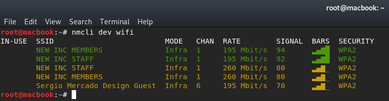
connected directly to laptop with no antenna

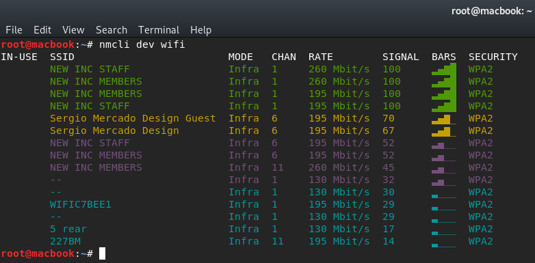
connected directly to laptop with 3 dB antenna

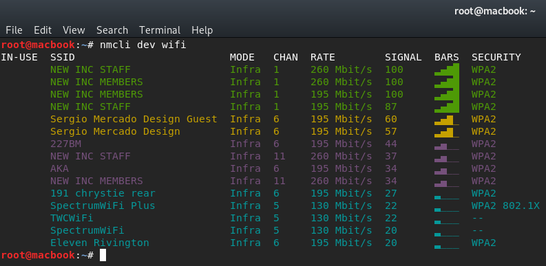
connected directly to laptop with 6 dB gain antenna

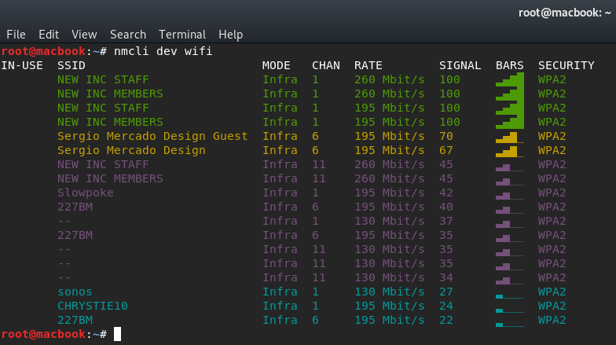
connected directly to laptop with 9 dB gain antenna

## Panda Wireless PAU05

### At a glance

* Driver: Ralink RT5372
* 2.4 GHz
* 300 Mbps
* No External Antenna
* Dimensions: 1 13/16" L x 13/16" W x 5/16" H
* USB 2.0 Dongle
* Max TX Power: -

### Performance:

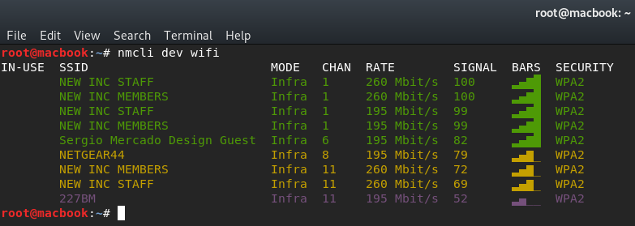
connected directly to laptop

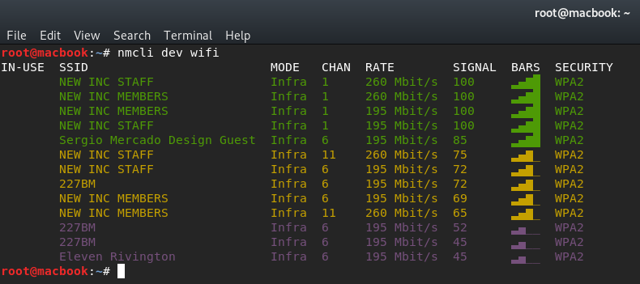
connected to 5' extension positioned 3' away, 1' elevated

## Panda Wireless PAU07

### At a glance

* Driver: Ralink RT5572
* 2.4 GHz b/g/n & 5 GHz ac/n
* 600 Mbps
* No External Antenna
* Dimensions: 2 11/16" L x 7/8" W x 3/8" H
* USB 2.0 Dongle
* Max TX Power: 20db

### Performance:

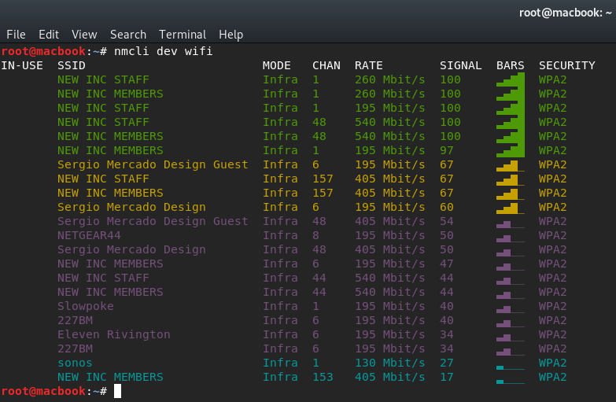
connected directly to laptop

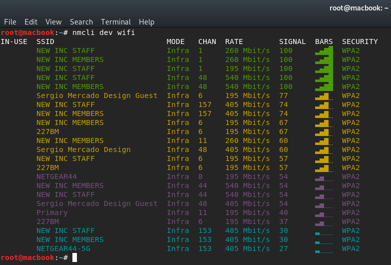
connected to 5' extension positioned 3' away, 1' elevated

## Panda Wireless PAU09

### At a glance

* Driver: Ralink RT5572
* 2.4 GHz b/g/n & 5 GHz ac/n
* 600 Mbps
* 2 External Antennas (detachable)
* Dimensions: 3 1/16" L x 1 7/16" W x 7/16" H (without antennas)
* Antenna Dimensions: 7 5/8" L x 1/2" W 
* USB 2.0 Dongle
* Max TX Power: 20db


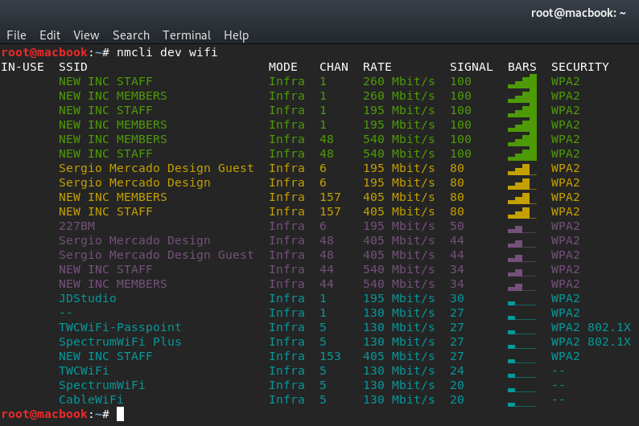
connected directly to laptop with antennas attached

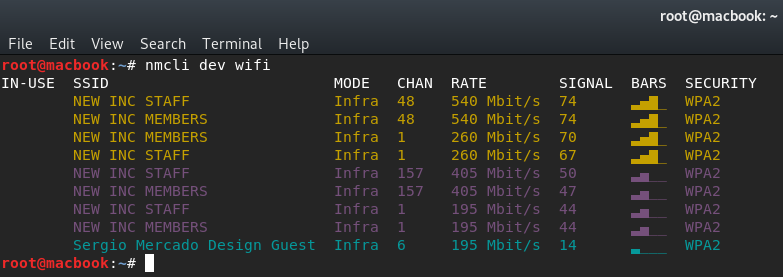
connected directly to laptop with antennas attached (no antennas)

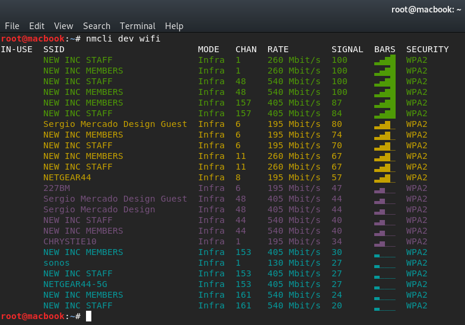
connected to 5' extension positioned 3' away, 1' elevated

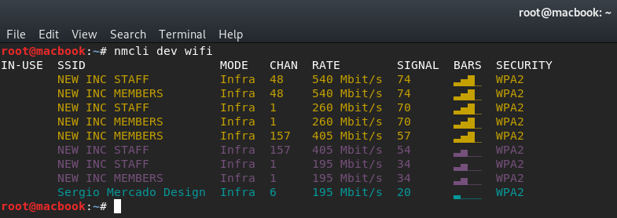
connected to 5' extension positioned 3' away, 1' elevated (no antennas)


## Alfa Networks AWUS036ACH

### At a glance

* Driver: Realtek RTL8812AU
* 2.4 GHz b/g/n & 5 GHz ac/n
* 1200 Mbps
* 2 External Antennas (detachable)
* Dimensions: " L x " W x " H (without antennas)
* Antenna Dimensions: 7 5/8" L x 1/2" W
* USB 3.0 connection via cable
* Max TX Power: 40db

### Performance:

## Fenvi RTL8812AU (X001LNJ6PB)

### At a glance

* Realtek RTL8812AU
* 2.4 GHz b/g/n & 5 GHz ac/n
* 1200 Mbps
* 2 External Antennas (non detachable)
* Dimensions: 3 13/16" L x 2" W x 5/16" H (including antennas)
* USB 3.0 Dongle
* Max TX Power: 40db
 
### Performance:

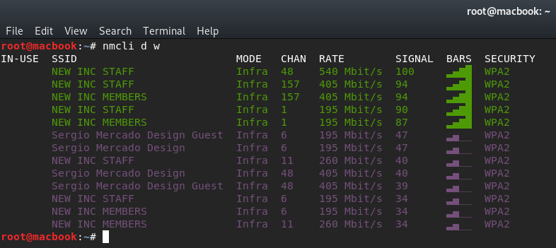
connected directly to laptop

## Fenvi RTL8811AU (X001LNJXOP)

### At a glance

* Realtek RTL8811AU
* 2.4 GHz b/g/n & 5 GHz ac/n
* 600 Mbps
* 1 External Antennas (detachable)
* Dimensions: 1 3/4" L x 13/16" W x 7/16" H (without antenna)
* Antenna Dimensions: 3 7/8" L x 3/8" W
* USB 2.0 Dongle
* Max TX Power: 40db

### Performance:

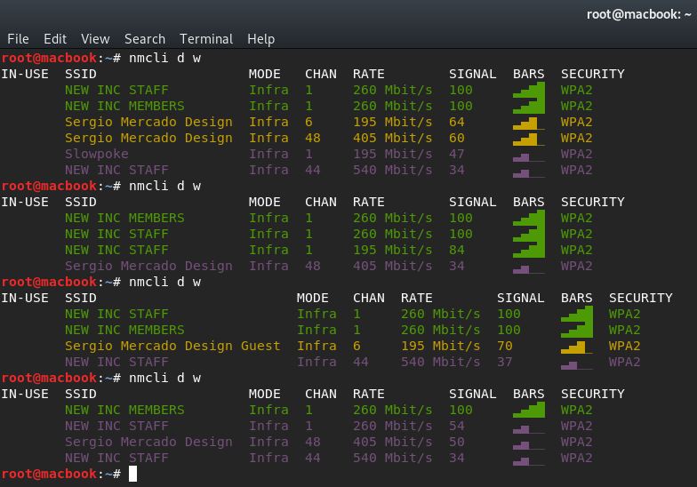
connected directly to laptop with antennas attached ( 9dB, 6dB, 3dB, stock )
