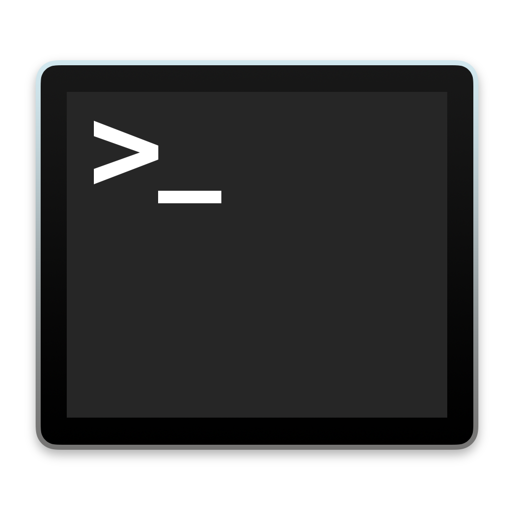
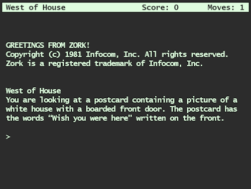
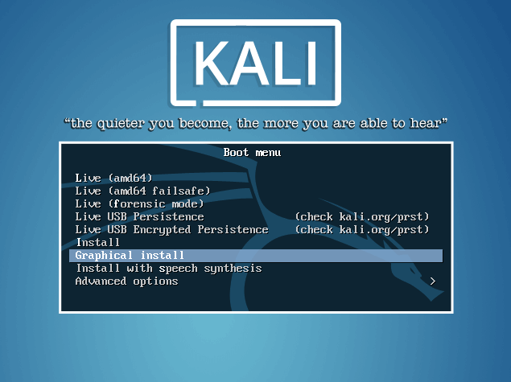

<!-- Ethical Hacking Module 01-->
<!-- by Phillip David Stearns 2019-->

# Ethical Hacking Module 1:

## Welcome!

This is the first installment of a series of ethical hacking courses for folks with non-technical backgrounds.

## Who this workshop is for:


* The average daily user of the internet.
* Mac OSX and Linux users (for now)

A technical background and some coding experience is helpful but not necessary. That’s the idea at least.

## What this workshop IS


* A first step towards an applied understanding of basic concepts of cyber security or cyber hygiene.
* A good starting point for those curious about how networks work.
* A fun way to explore real world attacks and how to defend against them.
* You want to learn a little about Linux and Unix systems.

By using ethical hacking principles to give us the attacker’s perspective we can better understand the reasons for and limitations of counter measures.

## What this workshop is NOT


* No, this is not a blackhat hacking workshop.
* If you want to join Anonymous, look elsewhere.
* We're not going to learn how to built a botnet.
* It's not offensive cyber security certification class.

## Who am I?


**An artist and designer, toolmaker and engineer.**

* Started in engineering physics
* BS Music from University of Colorado Denver
* MFA Music from Cal Arts
* 11 years hacking it as a "professional artist"

**I wear many hats, sometimes all at once:**

* Electronic music
* Circuit bender/hardware hacker
* Electronics designer and fabricator
* Video synthesis and 3D animation
* Glitch art
* Textile design
* Creative coding
	
**My portfolio: [phillipstearns.com](https://phillipstearns.com)**

**My Email:[phil@phillipstearns.com](mailto:phil@phillipstearns.com)**


### What’s my Interest

* My creative practice involves both making and breaking things.
* I enjoy understanding how things, systems, work and my approach has always been to take something apart, to reverse engineer a thing and look for other latent possibilities.
* In recent years, I’ve noticed something particularly dark happening on the internet and I’ve taken a keen interest in understanding the escalation of today’s cyber wars and the current cyber arms race.
* This workshop series distills my struggles with learning cyber security fundamentals into a user friendly guide to getting started and going deeper.

## What we’re covering today:

* Cyber Hygiene
* Hacking
* Terminals, Command Lines and Shells, namely Bash
* Writing and Executing Bash Scripts


## What you can expect to take away

* General understanding of Cyber Hygiene
* General understanding of Ethical Hacking
* Knowledge of basic bash commands
* Ability to write and execute your own bash scripts

---

# Cyber Hygiene


* Thinking about security as a “public health” issue.
* If we improve out own security, we improve the security of those around us.
* A set of best practices.


## For The Typical Internet User:

* Maintain complex Passwords
* Ensure Your Operating System is Up-To-Date
* Ensure Remote Desktop Protocol is Disabled
* Install and Maintain Antivirus/Antispyware Software
* Secure Your Internet Browser and Browser Add-ons
* Consider Using a Firewall
* Carefully Scrutinize Email Attachments
* Password Protect Your WiFi
* Back-Up Your Important Data

<span style="font-size: 75%">
  <i>CYBER HYGIENE CYBER SECURITY RECOMMENDATIONS</i>
  -- DHS United states Secret Service
  (October 5, 2016)
</span>

## Translated into Practical Advice:

There is no one size fits all approach to security, only a balance between security and convenience that must be assessed on an individual basis. Part of this assessment necessarily involves what's called *threat modeling*. By identifying the threats we want to protect ourselves, we can begin to consider what reasonable and effective measures we can take.

The list above provides a good starting point and a lot of those tips are pretty straight forward, but it doesn't do a good job of helping you identify what solutions are out there and how to assess which might best suit your needs.

Someone with sensitive information wishing to anonymously disclose it to the media would have to take a different security posture than an average user wanting to keep their internet browsing history safe from their Internet service provider or network administrator.

Threat modeling is a complicated process, one that unfortunately, we can't dive too deep into, but that said, here are some examples of what I use and why. By sharing my thinking, maybe this will give a sense of some of the threats and possible postures towards them.

### Think before you click

If you keep up with the rest of these practices, then data breaches will impact you most in the form of convincing Phishing campaigns. Ever received a bogus email appearing to be from someone you know? When you check the email address and it's something random, it's a good bet that someone got your contact info from a breach along with your contacts.

### Use Multi-Factor Authentication

I use an authenticator app by default and enable phone based 2FA where app based authentication isn't available. This adds another layer of protection in the event that your credentials are compromised in a breach and someone tries to access your account.

### Use a Password Manager

No, that plain text file you've been using is NOT a password manager. Neither is Keychain or the in-browser password saver. Differences between keychain and a password manager [explained](https://www.macworld.com/article/3060630/ios/why-not-pick-keychain-instead-of-1password-or-lastpass.html). I have a paid subscription to a password manager. It's a convenient way for me to securely store and access login credentials and encryption keys, or secret notes. It's secured with 2FA. If my laptop is compromised, it's not likely that someone will be able to access my online accounts as access to my password manager requires 2FA and the pass phrase.

### VPN

Use a VPN when surfing on untrusted networks or when you want to cloak your browsing from your ISP. There are a lot of good resources on what to look for in a VPN. If you want to stay anonymous, pay with a privacy focused crypto currency, make sure that no-logging practices are verified.

When you connect to a VPN, an encrypted connection or tunnel is made. All traffic into and out of your connection is sent down this tunnel.

What your local network admin sees: encrypted traffic between you and the VPN server

What your internet service provider sees: encrypted traffic between you and the VPN server

What your VPN sees: traffic between you and the server you're visiting, if https then encrypted, if http, then unencrypted.

What the site you're visiting sees: your browser details depending on your counter measures, the IP address of your VPN, possible access to your real IP address is WebRTC is exploited.

### Browsers

I use Firefox by default. It's improved greatly in recent years. Part of my switch was prompted by the fact that the Tor browser is based off Firefox. I am increasingly uneasy about the ability of Apple and Google to have access to my browsing history.

My settings mimic the amnesiac behavior of incognito mode for normal browsing, in addition to blocking third party cookies and blocking trackers. I've disabled WebRTC, WebGL, Flash, Camera and Microphone Access by default, as well as notifications and automatic downloads.

For plugins, I use AdNauseam ad blocker, No Script javascript blocker, EFF's Privacy Badger, HTTPS everywhere, Facebook Container and WebRTC disable.

### MAC Address spoofing

Using some of the techniques we'll explore in this class, I build a Bash script that allows me to quickly randomize my MAC address whenever I want. MAC addresses are typically unique and burned into hardware, making it possible to track a device across multiple networks. Networks use MAC addresses as part of the Address Resolution Protocol or ARP in order to assign and track IP addresses.

### Generic Network Name

If you really want MAC Address spoofing to work, you'll have to set your computer's network name to something generic too. How about MacBook or iPhone.

-

# Ethical Hacking


_**Legal Disclaimer:** As this workshop series progresses, you will learn skills that, if misused, can land you in a whole world of trouble, from lawsuits and legal prosecution to jail time. You must take responsibility for your actions. If you don’t own it, don’t hack it. If you're not authorized, it's illegal._

## Hacking

As broadly as possible: The use of technical knowledge and skills to cause a system to behave in ways not originally intended.

## Hacker

A computer hacker is any skilled computer expert that uses their technical knowledge to overcome a problem.

## Hacker Culture


A subculture of individuals who enjoy the intellectual challenge of creatively overcoming limitations of software systems to achieve novel and clever outcomes.[1] The act of engaging in activities (such as programming or other media[2]) in a spirit of playfulness and exploration is termed "hacking".

source: https://en.wikipedia.org/wiki/Hacker_culture

More broadly, hacking culture encourages the exploration of systems, tools, and technologies in the spirit of asking what these things can be made to do, rather than simply accepting what we've been told they can do.

## Security Hacker

A security hacker is someone who seeks to breach defenses and exploit weaknesses in a computer system or network.

### Basic Classifications:

* **Blackhat** - overtly malicious, motivated by personal gain
* **Greyhat** - seek out vulnerabilities for broader disclosure
* **Whitehat** - authorized to test systems in order to improve security

Both Blackhat and Greyhat hacking is considered illegal.

## Penetration Testing

A form of Whitehat hacking often based on a method of offensive security practice. Also called Red Teamers, Penetration Testers adopt the mindset of the attacker to help defend networks. By simulating attack and exposing weaknesses, pen testers help security teams improve defensive postures and defend against real-world attacks.

## Keeping it Ethical


We're learning how to hack ourselves solely for the purpose of improving our own security.

Other philosophical discussions of what constitutes ethics and whether those ethics are aligned with particular morals or codes of social conduct are beyond the scope of this workshop.

Our mantra: "If you don't own it, don't hack it."

Not: "If you can't hack it, you don't own it."

## Further reading:  
[The Hacker Crackdown](http://www.mit.edu/hacker/hacker.html)  
[What is Hacking](https://www.guru99.com/what-is-hacking-an-introduction.html)
[Hacker Culture](https://en.wikipedia.org/wiki/Hacker_culture)
[Security Hacker](https://en.wikipedia.org/wiki/Security_hacker)

-

# Terminals - Command Lines - Shells


**Terminal:** text input and output environment or application.

**Command Line:** the interface where users enter (type) and execute (press enter) commands.

**Shell:** a user interface for access to an operating system’s services. can be graphical (GUI) or text based command line interface (CLI).

###### [ref 1](https://askubuntu.com/questions/506510/what-is-the-difference-between-terminal-console-shell-and-command-line)| [ref 2](https://www.shsu.edu/~csc_tjm/cs431/shellprog.html)| [ref 3](http://homepages.uc.edu/~thomam/Intro_Unix_Text/File_System.html)| [ref 4](https://www.howtogeek.com/125157/8-deadly-commands-you-should-never-run-on-linux/)

## Terminal.app



Though there are many different terminal applications and command-line interface shells, we’re going to focus on the basic “out of the box” tools provided by OSX.

Let’s open up the terminal.app in OSX, which logs us into a bash shell environment, presenting us with a command line interface.


Press `command + spacebar` to bring up the spotlight search prompt. Type `terminal.app` and press `enter`.

You can also access the terminal application from Finder by navigating to **Applications** > **Utilities** > **Terminal.app**

## Bash the Bourne Again Shell


Bash is a Unix shell written by Brian Fox. It replaces the Bourne shell, developed by Stephen Bourne. Bash is a short for Bourne-again Shell, yes, I see what Brian did there very punny…

Bash is a command processor that runs in a text window. It can also read and execute commands from a file, a shell script.

## Commands



Anyone remember Zork?

Imagine you woke up with amnesia, and have no idea who you are or where you are.

You might ask some obvious questions like...


## Who am I?

	whoami

This command displays the effective user ID. By default, OSX logs you into a bash session with the account you executed the application with. It's possible to change your user ID using the login command. From there you can enter the user and password.


## What does command do?

There are a few different ways we can find out what a command does

1. `command` Sometimes a command will just tell you what kind of input it’s expecting
2. `man command` Short for **MAN**ual, `man` gives you the full story of a command.
3. `command -h` or `command --help`

Note: In these examples we're adding what are called arguments to our command. When the command is executed, these arguments are used as input which can either enable or disable certain **options** or provide data or parameters as **arguments**. More on this later.


## Where am I?

	pwd

This command returns the **P**athname of the current **W**orking **D**irectory. When you execute commands, by default they act on the current working directory.


## Look around.

	ls

**L**i**S**t lists the contents of a directory.

1. Enter `ls` to view the contents of your current working directory.
2. Enter `ls ~/Downloads` to view the contents of your downloads folder.


## Piping and grep


If you're like me, then the list doesn't fit on one screen.

The `|` or glyph character lets us "pipe" the output from one command to the input of another. Piping is a form of output redirection. More on this later...

Enter `ls ~/Downloads | less` to pipe the output to the `less` command input.

You can also pipe to commands like `grep` to filter results. If you wanted to return only results from `ls` that had the extension `.sh`, you could pipe the output of `ls` to `grep` like so: `ls | grep .sh`.

But then you could also use the wildcard symbol `*` with `ls`. `ls *.sh` is much simpler and does the same. `grep` comes in handy with commands that don't use the wildcard or when we're looking for more complex patterns.


## Less

	less

displays a file or input stream in a way that allows for movement forwards and backwards interactively.

1. Press `q` to return to the command line.


## `ls` options:

Let's enter `man ls` and  check out the **synopsis** or usage example:

	ls [-ABCFGHLOPRSTUW@abcdefghiklmnopqrstuwx1] [file ...]

Here we see the command `ls` followed by a list of available `[-options]` followed by an additional arguments `[file ...]`

## Options

These are "switch" arguments passed to a command, enabling or disabling certain features and are specified by prefixing a `-` to some letter or number.

Some of these options require additional arguments. For example, a command may have an option to output to a file using the `-o` switch followed by the path to the file.

	command -o /path/to/file/filename.ext

It’s typical to see a command usage indicate how a command is used, e.g.

	Usage: command [-options] [args ...]

## Tidying Up

Things might get messy at this point. Need to clear your screen?

	clear

## Navigation

	cd

Changes the current working directory. Think of this as where you are.

### Examples:

* `cd directory` change to a directory in your current working directory
* `cd ..` change one directory "up"
* `cd ../directory` change to directory one directory "up"
* `cd /` change to the root directory
* `cd /directory` change to a directory in the root directory
* `cd ../../../` move three directories "up"
* `cd ../../../directory` change to a directory three directories "up"
* `cd ~` change to the home directory

## File Manipulation


Caution! **_DO NOT_** run commands preceded by this sign: 🛑

It's possible to permanently and irreversibly overwrite or delete files with some of these commands. For safety sake, please make sure to run these from your home `~` directory.

Run `cd ~` and `pwd` to make sure you're in `/Users/YourUserName`

## Make Directory

	mkdir

1. Run `mkdir ~/playpen` to create a new directory (folder) for us to play in.
2. Then run `cd ~/playpen` to change to that folder.

You can create a directory in a location other than your present working directory by specifying the full path, e.g. `mkdir /Users/YourUserName/Documents/MyNewDir`

Tip: You can string commands together in a single command line entry using `;`. For example, you can run `mkdir ~/playpen; cd ~/playpen` to create a directory and change to it.

## Remove Directory

	rmdir 
    
Removes an empty directory

1. Make a directory to delete: `mkdir delete_me`
2. View the fruits of your labor: `ls`
3. Now clean up: `rmdir delete_me`

You can remove an empty directory in a location other than your present working directory by specifying the full path, e.g.
`rmdir /Users/YourUserName/Documents/AnEmptyDirectory`

## Creating Files

It's possible to create files from scratch. Here are a few different ways.

	$ > /path/to/new/file/filename.ext
	$ touch /path/to/new/file/filename.ext
	$ echo > /path/to/new/file/filename.ext
	$ cat < /path/to/new/file/filename.ext

Let's try them out!

## Creating Files

1. Run `cd ~/playpen`
2. Run `> ~/playpen/new_files/made_from_scratch.txt`
3. Run `touch ~/playpen/new_files/made_with_touch.txt`
4. Run `echo 'Made with echo" > ~/playpen/new_files/made_with_echo.txt`
5. Run `cat > ~/playpen/new_files/made_with_cat.txt`

This last command doesn't return you to the prompt. Instead it allows you to write directly to the new file, line by line.

Type `This file was made with cat.` and press return.
Then press `control + c` to end the process.

## Write to the standard output

	 echo

Can be used to write string and stored values to the standard output.

### Example:

`echo ‘hello world!’`
`echo $HOME`

## Printing files to the standard output

	cat
    
Concatenate and print files. Usually used with the `>` to contents to standard out

### Examples

`cat file1.txt file2.txt file3.txt > file4.txt`

## Redirection

	| > >>

These symbols redirect the output of a command to different places.
* `|` pipes the output of the preceding command to the input of the following
* `>` directs the output of the preceding command to a specified file, overwriting it if it exists.
* `>>` directs the output of the preceding command to a specified file, concatenating it to the existing file.

### Examples:
* `ls ~/Downloads > ~/Desktop/my_downloads.txt`
* `echo 'This is the first line.' >> newfile.txt; echo 'This is the second line.' >> newfile.txt`

## Copying

	cp

Copies a file or directory from one location to another.

### Examples:

`cp source_file.ext dest_file.ext`
`cp -r /source/directory/ /destination/directory/`


## Deleting

	rm

Deletes a file or directory. **!!! There is no way of undeleting !!!**

### Examples:

`rm /path/to/file/filename_1.ext /path/to/file/filename_2.ext`
`rm /path/to/directory1 /path/to/directory2`

WARNING!!!
🛑 `rm -rf /` will completely erase your file system, including any mounted drives/volumes


## Opening Files

	open

Uses the OS to launch the default application for viewing a specified file. Can also be used to launch an application.
    
### Examples:
`open /path/to/file/file.ext`
`open /Applications/Application.app`

## Variables

We can store and recall values in variables.

1. Run `a=1`
2. Run `b=2`
3. Run `c=a+b`
4. Run `d=$a+$b`
5. Run `let e=$a+$b`
6. What do we get when we run `echo $c`
7. How about `echo $d`
8. And `echo $e`

[more on arithmetic in bash](https://ryanstutorials.net/bash-scripting-tutorial/bash-arithmetic.php)

## Variables

We can store and recall values in variables.

1. Run `var1=cat`
2. Run `var2=dog`
3. Run `var3=var1+var2`
4. Run `var4=$var1$var2`
5. What do we get if we run `echo $var3`?
6. How about `echo $var4`?

---

# Scripting


It all starts with a `#!` (shebang)

## Why write a script?

There are times where you might find yourself entering the same sequences of commands to perform routine tasks. Scripting allows you to create a file that can execute those commands with a single command. Scripts can be simple, involving a fixed, or “hard coded”, list of commands to be executed in order, or can be more complex, utilizing variables, conditionals, loops, and other features you might find in a proper programming language.

Noe we're going to write a super simple script, change it's permissions to make it executable, and then create a symbolic link to it so that we can execute it just like any of our other commands.

## Do it from the CLI!
1. `mkdir ~/Documents/Scripts/`
2. `cd ~/Documents/Scripts/`
3. `> helloworld.sh`
4. `nano helloworld.sh`


## nano

`nano` is a basic text editor.
`control + g` gives us the help menu
`control + x` exits

## helloworld.sh

In `nano` type:
	
    #!/bin/bash
    clear
    echo 'Hello World!'
    
Then press `control + x`
Followed by `y` for yes
And finally, `enter` to exit and save.


## helloworld.sh

You can run our script with `bash helloworld.sh`


## chmod

```
chmod
```
    
Changes file modes or Access Control Lists. We can use this command to make our script executable.

### Example:

`chmod +x helloworld.sh`

Now we can execute it by typing `./helloworld.sh`

## ln

```
ln
```

Creates a link from one file to an alias in another location.

`ln -s /path/to/our/helloworld.sh /usr/local/bin/helloworld`

Running this command will create a symbolic link to our `helloworld.sh` script in our `/usr/local/bin` folder. If we run `echo $PATH`, we can confirm that `/usr/local/bin` is in the `PATH` bash uses to locate commands.

## changing our Bash Profile file

Another way to ensure that our executable scripts can be found by our shell is by changing the $PATH variable by adding lines to the `~/.bash_profile` file.

If you make a `scripts` directory in your home directory, by executing `echo "export PATH=\"/Your/HomeDirectory/scripts:\$PATH\"" >> ~/.bash_profile` will be able to execute any scripts, like `myscript.sh` there in simply by typing `./myscript.sh` anywhere.

---

# Congratulations!

Thanks for taking this workshop. It's still a work in progress and I'd appreciate any feedback you have. If you want to go deeper, the following slides have basic commands for viewing and changing network settings.

---

# Preview of Module 02



## Setting up Kali Linux

This module is dedicated to getting students setup with a live bootable Kali linux system.
USB drive and USB WiFi dongle are included!

---

# Networking Commands

```
ping
traceroute
arp
ifconfig
ipconfig  
```

## ping

```
ping
```

Sends ICMP ECHO_REQUEST packets to network hosts. When we send a ping to a device, we expect a response. `ping` sends the request and listens for the response and gives us some statistics about the response time.

### Examples:

`ping 1.1.1.1`
`ping google.com`

## traceroute

```
traceroute
```
    
Shows the route packets take to a network host.

### Examples:

`traceroute 1.1.1.1`
`traceroute google.com`


## arp

```
arp
```
    
**A**ddress **R**esolution **P**rotocol (ARP) display and control.

Every network device has a unique **M**edia **A**ccess **C**ontrol (MAC) address. When connecting to a network, your MAC address is assigned to a unique **I**nternet **P**rotocol (IP) address on that network. ARP tables allow networked devices to communicate directly to one another by resolving their IP to their MAC addresses and visa versa.

The `arp` command shows us the ARP table and gives us the ability to add and remove entries.

### Examples:
`arp -aln` displays the arp table
`sudo arp -ad` deletes all arp table entries

## ifconfig

```
ifconfig
```
    
Allows us to view and configure network interface parameters.

### Examples:
`ifconfig en0` gives us network connection information for the interface `en0`
`ifconfig en0 ether` prints just the current MAC address for `en0`


## ipconfig

```
ipconfig
```

Allows us to view and control IP configuration state.

### Examples:
`ipconfig getifaddr en0` prints our local IP address


## grep
```
grep
```

A very flexible and feature packed file pattern searcher.

### Basic Examples:
`ifconfig en0 | grep broadcast` prints the line containing `broadcast`
`arp -aln | grep -oE '([0-9]{1,3}\.){3}[0-9]{1,3}'` returns IPs in the arp table

---

# That's All for Now!


Keep on hacking! See you next session!