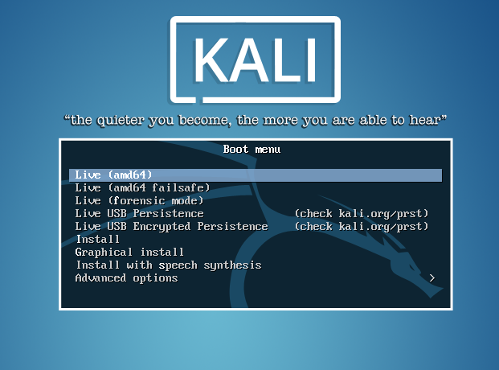
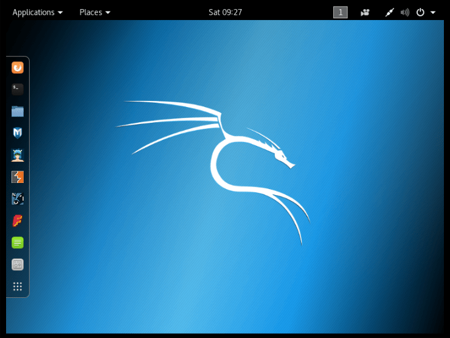

# Setting up a Kali VM

Ingredients:

* A computer (this guide made for MAC machines)
* Homebrew
* wget or gpg
* VirtualBox
* Kali Linux Image

## Homebrew - [https://brew.sh](https://brew.sh)


A package manager for MACs but also Linux. Think of this like an AppStore but for hackers. Package managers help track dependencies for applications, compile and install/deinstall programs. It's really handy for 1337 hackers and developers looking for obscure command line interface tools, but can also be used to update GUI applications, like Firefox.

### Install Homebrew

1. Open the terminal.app
2. Copy and paste `/usr/bin/ruby -e "$(curl -fsSL https://raw.githubusercontent.com/Homebrew/install/master/install)"` and press enter

*You may have to download and install XCode command line interface tools. This will take a while [sorry!].*

Done!

## Install Handy Tools

We're going to download some tools to give us a couple of options in the future:

* [balenaEtcher](https://www.balena.io/etcher/) - This utility can be used to flash USB drives quickly and reliably. If you want to create a Linux live boot USB drive or flash a MicroSD card for your RaspberryPi, this is the tool I recommend.
* [`wget`](https://formulae.brew.sh/formula/wget) - Internet file retriever. Like `curl` but with more features.
* [gnupg](https://formulae.brew.sh/formula/gnupg#default) - GNU Pretty Good Privacy (PGP) package.

`wget` and `gnupg` will be used in obtaining and validating/verifying signatures and signing keys to make sure that we can trust our software.

This is a step we often don't take as normal users and is something that most OSes do behind the scenes, but since we're dealing with serious tools and using them on sensitive systems, we want to know how to verify for ourselves that our software is legit and hasn't been tampered.

## VitrualBox

Since hardware on the new MacBooks is not fully supported by Linux yet, we'll be learning how to setup Kali on a VirtualBox Virtual Machine (VM).

### A word on VMs

VMs emulate the functionality of hardware using software. They provide the functionality of a physical computer that may be different from the base operating system and architecture. In short, a VM is what enables us to run Linux within Mac OSX.

Note: Virtualization requires a lot of resources on the native system like memory.

### Download, Verify

1. Obtain a copy of VirtualBox either from the class supplied USB drive or from [https://www.virtualbox.org/wiki/Downloads](https://www.virtualbox.org/wiki/Downloads).
2. Obtain a copy of the SHA256SUMS from the USB drive or [https://www.virtualbox.org/download/hashes/6.0.14/SHA256SUMS](https://www.virtualbox.org/download/hashes/6.0.14/SHA256SUMS)
3. Place these files in a common directory for example `/Users/yourUserName/Documents/VirtualBox/`
4. Open the terminal.app
5. change to the directory where you've saved the VirtualBox binary and SHA256SUMS files, for example: `cd /Users/yourUserName/Documents/VirtualBox/`
6. run the following command to verify that your binaries downloaded correctly: `shasum -c SHA256SUMS 2>&1 | grep OK`

### What's going on here?

A shasum is a hash or unique number generated by a cryptographic algorithm. The output is the same length regardless of the input. 

1. Running `shasum -a 256 "/path/to/some.file"` will calculate the shasum of `some.file` using the sha-256 algorithm, which outputs a unique 32 bit value.
2. This value can be compared with a pre-calculated hash value to check the file integrity. This is what is done with `shasum -c SHA256SUMS`, it goes through the shasums in the list, looks for the file and compares the hash in a semi- automatic fashion.
3. The `2>&1 | grep OK` portion of the command suppresses the printing of errors (`2>&1`), pipes the resulting output into `grep` and returns lines that contain `OK` (`| grep OK`).

### Is this secure?

Nope! I could make alterations to the binaries and just save the hash values in the SAH256MUS files... but the signature is being verified by OSX in the background so take off that tin foil hat and install it!

### Install

1. Double click on the .dmg file
2. Double click on the .pkg file
3. Follow in install wizard
4. Enter your password when prompted
5. Done!

## Kali Linux


### About the Kali Linux Distribution
>
>Kali Linux is an open source project that is maintained and funded by Offensive Security, a provider of world-class information security training and penetration testing services. In addition to Kali Linux, Offensive Security also maintains the Exploit Database and the free online course, Metasploit Unleashed.
>-- [source](https://www.kali.org/about-us/)

### Downloading Kali Linux

1. Obtain a copy of the Kali Linux 64-Bit .iso file from the provided USB drive or download it from [https://www.kali.org/downloads/](https://www.kali.org/downloads/)
2. Obtain a copy of the SHA256SUMS and SHA256SUMS.gpg files from the USB or download from [http://cdimage.kali.org/](http://cdimage.kali.org/). Be sure to choose the corresponding distro version!
3. Download the Kali Linux Signing Keys using either `wget` or `gpg`:

```
$ wget -q -O - https://www.kali.org/archive-key.asc | gpg --import
# or...
$ gpg --keyserver hkp://keys.gnupg.net --recv-key 7D8D0BF6
# ...and verify that the displayed fingerprint matches the one below
$ gpg --fingerprint 7D8D0BF6
pub rsa4096 2012-03-05 [SC] [expires: 2021-02-03]
44C6 513A 8E4F B3D3 0875 F758 ED44 4FF0 7D8D 0BF6
uid [ unknown] Kali Linux Repository <devel@kali.org>
sub rsa4096 2012-03-05 [E] [expires: 2021-02-03]
```

4. Verify the signature of the SHA256SUMS file `gpg --verify SHA256SUMS.gpg SHA256SUMS`. Check that the output matches:

```
gpg: Signature made Mon Sep  2 06:42:05 2019 EDT
gpg:                using RSA key 44C6513A8E4FB3D30875F758ED444FF07D8D0BF6
gpg: Good signature from "Kali Linux Repository <devel@kali.org>" [unknown]
gpg: WARNING: This key is not certified with a trusted signature!
gpg:          There is no indication that the signature belongs to the owner.
Primary key fingerprint: 44C6 513A 8E4F B3D3 0875  F758 ED44 4FF0 7D8D 0BF6
```

If you don’t get that “Good signature” message or if the key ID doesn’t match, then you should stop the process and review whether you downloaded the images from a legitimate Kali mirror.

5. Finally, run `grep kali-linux-2019.3-amd64.iso kali-linux-2019.3-amd64.iso.txt.sha256sum | shasum -a 256 -c` and verify that you get:

```
kali-linux-2019.1-amd64.iso: OK
```
6. If you're super paranoid you can "manually" check that `shasum -a 256 kali-linux-2019.1-amd64.iso` matches the sha256sum hash provided:

```
5596f2b5da66a45a6e6d14510cedc3fc20980f21d01c18059809ef651e6726dd
```
Phew! Our files are legit and untampered. Straight from the source!

## Creating a new VM

1. Launch VirtualBox.app
2. Click the "New" button
3. Give your VM a 1337 name like `haXX0rz d3n`
4. Save the VM where ever you like, the default directory is fine. 
5. Set `Type:` to `Linux`
6. Set `Version:` to `Other Linux (64-bit)`
7. Click `Continue`
8. Set the amount of memory the VM will use, click `Continue`
9. Choose `Create a virtual disk now`, click `Create`
10. Choose `VDI`, click `Continue`
11. Choose `Dynamically allocated`, click `Continue`
12. Set the max size of the virtual disk, click `Create`
13. Click `Settings`, then click `Storage`, then click the optical drive below the `.vdi` controller.
14. In the `Attributes` section, click the disc icon next to the `Optical Drive:` field
15. Click `Choose Virtual Optical Disk File`, navigate to and select the Kali Linux ISO and click `Open`, finally click `OK`
16. Click the green `Start` arrow.

### Congratulations!

You can now boot into Kali Linux Live mode.

# EXPERIMENTAL

Everything below this point has not been tested with a VM setup. Expect weirdness.

## Setting up Encrypted Persistence (Optional)

This walkthrough borrows heavily from the official [Kali Linux Live USB Persistence Guide](https://docs.kali.org/downloading/kali-linux-live-usb-persistence).

It's cool enough that we're able to boot up from the Live USB drive on almost any machine, but what if you want to add some customized tools or save some of your work on the drive too? We need to setup persistence, the ability to save our changes between Live boots.

But what happens if you loose your thumb drive? If the data isn't encrypted and you've left sensitive data on it, you have just compromised yourself and the clients whose most sensitive network data are on that drive.

To cover you @\$\$ and your clients', we need to make sure we've encrypted our Live bootable USB's persistent volume.



1. When you boot into Kali, a splash screen will appear. Select the option `Live USB Encrypted Persistence` and press enter.



2. Once your desktop loads, look for the Terminal in the dock to the left. Click it to open the Terminal. You can also run it by pressing `command+shift+2`.

3. Run `fdisk -l` to verify that we can see the `/dev/sdb1` and `/dev/sdb2` partitions. You should see info for other drives on your system but focus on Disk /dev/sdb:

```
Disk /dev/sdb: 57.3 GiB, 61505273856 bytes, 120127488 sectors
Disk model: Ultra Fit       
Units: sectors of 1 * 512 = 512 bytes
Sector size (logical/physical): 512 bytes / 512 bytes
I/O size (minimum/optimal): 512 bytes / 512 bytes
Disklabel type: dos
Disk identifier: 0xdb584c61

Device     Boot   Start     End Sectors  Size Id Type
/dev/sdb1  *         64 6691199 6691136  3.2G 17 Hidden HPFS/NTFS
/dev/sdb2       6691200 6692607    1408  704K  1 FAT12
```

4. We want to create a partition after our Kali Live partitions above. We do this with the `parted` command by specifying where we want to start and end our partition. The Kali Live partitions end at **sector 6692607** and the total disk size is **61505273856 bytes**, so we want our new partition to **start at sector 
6692608** and **end at 61505273855 bytes**. Run the following command using numbers specific to your current image and drive:

```
parted /dev/sdb mkpart primary 6692608s 61505273855b
```

5. The parted command may advise you that it can’t use the exact start value you specified; if so, accept the suggested value instead by typing "Y" and pressing enter. If advised that the partition isn’t placed at an optimal location, ignore it by typing "I" and pressing enter. When parted completes, the new partition should have been created at `/dev/sdb3`; again, this can be verified with the command `fdisk -l`:

```
Device     Boot   Start       End   Sectors  Size Id Type
/dev/sdb1  *         64   6691199   6691136  3.2G 17 Hidden HPFS/NTFS
/dev/sdb2       6691200   6692607      1408  704K  1 FAT12
/dev/sdb3       6692608 120127487 113434880 54.1G 83 Linux
```

6. Next, we initialize LUKS encryption on the partition we just created. When warned that the operation will overwrite any data on the partition, type `YES` (all uppercase):

```
cryptsetup --verbose --verify-passphrase luksFormat /dev/sdb3
```

7. You'll be prompted for a pass phrase. Use a pass phrase that is strong and memorable or store this in a safe place. You'll have to enter it at every boot into `Live USB Encrypted Persistence`. You can still Live boot without it, but won't have access to encrypted data without it. Enter it a second time to confirm. Now to finish setting up the persistence on the encrypted partition:


```
cryptsetup luksOpen /dev/sdb3 my_usb
```


8. Create the ext3 filesystem, and label it “persistence”. (each line is a new command)

```
mkfs.ext3 -L persistence /dev/mapper/my_usb
e2label /dev/mapper/my_usb persistence
```

9. Create a mount point, mount our new encrypted partition there, set up the persistence.conf file, and unmount the partition. (each line is a new command)

```
mkdir -p /mnt/my_usb
mount /dev/mapper/my_usb /mnt/my_usb
echo "/ union" > /mnt/my_usb/persistence.conf
umount /dev/mapper/my_usb
```

10. Close the encrypted channel to our persistence partition.

```
cryptsetup luksClose /dev/mapper/my_usb
```

-

# Congratulations!


You've now got a secure live bootable hacking platform on a USB drive. Use your powers wisely.

## Wait... Where's my WiFi?


Chances are, the bulit-in WiFi adapter on your laptop won't be supported by Kali. That's what I've provided some handy USB WiFi adapters. Among other things, these will get you jacked back into the Internet.

1. Plug in your Panda PAU05 USB WiFi adapter
2. Open the Terminal by pressing `command+shift+2` or clicking its icon in the dock.
3. Run the command `nm-connection-editor`.
4. Click the **+** button to add a new network connection.
5. Select **"Wi-Fi"** from the pull-down menu and click **"Create"**.
6. Give the connection a simple, easy-to-remember **"Connection name"**.
7. Enter the **SSID** or name of the WiFi network
8. Select the **"wlan0"** device from the **"Device"** pull-down menu.
9. Select **"Random"** from the **"Cloned MAC address"** pull-down menu.
10. Click the **"Wi-Fi Security"** tab and choose **"WPA & WPA 2 Personal"** from the **"Security"** pull-down menu.
11. *(optional)* Click the **"General"** tab and uncheck all the boxes.
12. Click **"Save"** and close the window.
13. Bring up the Terminal and run `nmcli c up "<Connection name>"` and replace `<Connection name>` with whatever you named the connection. Note: if you used spaces, you need to use `""`.

You should now be connected to the Internets!

## Maintaining Kali with `apt`

APT is short for Advanced Package Tool that manages the installation and removal of software on Linux distributions like Debian and Ubuntu. Kali is a Debian based distribution so we use `apt` to do all the same things we'd use `brew` for in OSX, and more.

**WARNING!** Updating your software packages might take a long time and eat up a lot of disk space.

The process for updating all the software on you Kali Live USB with Encrypted Persistence is as simple as running:

```
apt update && apt dist-upgrade
```

If for some reason, apt update gives you a weird error like:

```
E: Could not get lock /var/lib/apt/lists/lock - open (11: Resource temporarily unavailable)
E: Unable to lock directory /var/lib/apt/lists
```

Run this:

```
rm /var/lib/apt/lists/* -vf
```

And try again.

Once the process is going, it'll take a while. When it's finished run:

```
apt autoclean
apt autoremove
```
If prompted, type "Y" and press enter to remove unused dependencies.

Make some time to regularly run these commands.

-


Now we can get to hacking like pros.

Thanks for taking the first two modules of Ethical Hacking. Now that we have a working understanding of the UNIX/LINUX command line interface AND a shiny new Kali, we're ready to move on to:

## Module 03

* **WiFi Hacking** - WPS and WPA attacks

## Module 04:

* **Network Discovery** - Host Discovery and Port Scanning
