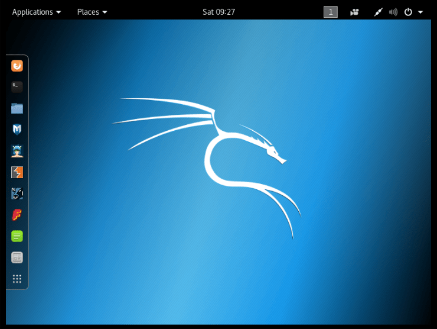
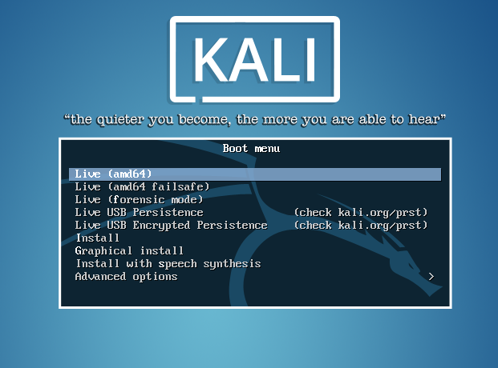

<!-- Ethical Hacking Module 02-->
<!-- by Phillip David Stearns 2019-->

# Ethical Hacking Module 2:



## Getting Started with Kali Linux

This is the second installment of a series of ethical hacking courses for folks with non-technical backgrounds.

## What we’re covering today:

* package managers
* shasum hash and signature verification
* burning a Kali iso to a flash drive
* configuring encrypted persistence
* getting familiar with kali


## What you can expect to take away

* a USB thumbdrive capable of turning any system into a penetration testing platform.
* a USB wifi adapter capable of short range attacks on WiFi routers

## Package Managers


### Homebrew for OSX

**Package Managers** are tools that allow system admins to quickly and gracefully install, remove and update installed software packages.

You may have noticed that the installation process for most apps on OSX is as simple as downloading the .app package and moving it to the Applications folder. Others may ask for your permission to write files to disk.

When you want to remove an application, sometimes it's not simply enough to drag and drop the app in the trash. There are files stored elsewhere that remain.

There are times when you want to update all your applications at once. Opening each and checking for updates is a pain.

These are cases where a package manager comes in handy.

[Homebrew](https://brew.sh/) is the missing package manager for OSX.

Get it now by running:

```
/usr/bin/ruby -e "$(curl -fsSL https://raw.githubusercontent.com/Homebrew/install/master/install)"
```

### Install GPG tools

In order to securely download and verify Kali Linux, we need to have Balena Etcher, wget and GPG installed. We can use our shiny new Homebrew utility to help us out. (each line is a new command)

```
brew cask install balenaetcher
brew install gpg wget
```

We'll use this to verify the code signature of our Kali sha256sums and the .iso itself.

### apt-get for Linux

The Linux command line interface package handling utility. For all the same reasons you'd want to use Homebrew on OSX. We'll get more into using this utility once we have Kali setup.

## Download Kali Linux Images Securely

This walkthrough borrows heavily from the official [Downloading Kali Linux Guide](https://docs.kali.org/introduction/download-official-kali-linux-images).


We're downloading a tool that contains tools that can be easily used for offensive purposes, one that has the ability to inflict serious harm on connected systems if not handled with care. To ensure the integrity of your security and the security of anything you might be hacking, it is absolutely necessary to verify your .iso files before you do anything else! The last thing we want is to infect ourselves and our friends or clients with malicious software.

I've taken the liberty of downloading all the necessary .iso files to speed things along. Let's get on to verifying them from step 3 on.

1. Create a folder for you Kali .iso and related files. Launch the `terminal.app` and `cd` into that directory.
2. Download the most recent Kali .iso, `kali-linux-2019.1-amd64.iso` at the time of writing, along with the `SHA256SUMS` and `SHA256SUMS.gpg` files from - [Kali Linux Download Server](https://cdimage.kali.org/current/)
3. Before verifying the checksums of the image, you must ensure that the `SHA256SUMS` file is the one generated by Kali.
4.  Download the Kali code signing keys:
```
wget -q -O - https://www.kali.org/archive-key.asc | gpg --import
```
5. Run `gpg --fingerprint 7D8D0BF6` and verify that the fingerprint matches the one below:

``` 
pub   rsa4096 2012-03-05 [SC] [expires: 2021-02-03]
      44C6 513A 8E4F B3D3 0875  F758 ED44 4FF0 7D8D 0BF6
uid           [ unknown] Kali Linux Repository <devel@kali.org>
sub   rsa4096 2012-03-05 [E] [expires: 2021-02-03]
```
	
6. Verify the signature by running `gpg --verify SHA256SUMS.gpg SHA256SUMS` and check that the output matches:

```
gpg: Signature made Sun Feb 17 14:06:55 2019 EST
gpg:                using RSA key 44C6513A8E4FB3D30875F758ED444FF07D8D0BF6
gpg: Good signature from "Kali Linux Repository <devel@kali.org>" [unknown]
gpg: WARNING: This key is not certified with a trusted signature!
gpg:          There is no indication that the signature belongs to the owner.
Primary key fingerprint: 44C6 513A 8E4F B3D3 0875  F758 ED44 4FF0 7D8D 0BF6
```

If you don’t get that “Good signature” message or if the key ID doesn’t match, then you should stop the process and review whether you downloaded the images from a legitimate Kali mirror.

7. Finally, run `grep kali-linux-2019.1-amd64.iso kali-linux-2019.1-amd64.iso.txt.sha256sum | shasum -a 256 -c` and verify that you get:

```
kali-linux-2019.1-amd64.iso: OK
```
8. If you're super paranoid you can "manually" check that `shasum -a 256 kali-linux-2019.1-amd64.iso` matches the sha256sum hash provided:

```
5596f2b5da66a45a6e6d14510cedc3fc20980f21d01c18059809ef651e6726dd
```
Phew! Our files are legit and untampered. Straight from the source!

## Writing our Kali .iso to our USB drive

There are two methods we can choose from to write the Kali .iso file to a USB drive. We'll explore both. The second part of this walkthrough borrows heavily from the official [Making a Kali Bootable USB Drive Guide](https://docs.kali.org/downloading/kali-linux-live-usb-install).


### Option 1: Quick and Easy with Balena Etcher

In the interest of saving time in the workshop context, there's a quick and safe option for writing your Kali .iso file to your USB drive.

1. If you didn't already do so, run `brew cask install balenaetcher` to install Balena Etcher.
2. Open Balena Etcher by running `open /Applications/balenaEtcher.app`
3. Click **"Select image"** and choose the kali .iso
4. Click **"Select drive"** and choose the USB thumbdrive
5. Click **"Flash!"**
6. To boot from our drive, run `sudo reboot` and hold down **option** as the device boots. Our live boot will show up as EFI. Select it and press enter.

Users of the newer MacBookPros with the T2 chips will have to jump through some extra hoops to bypass some of the security features. 

### Option 2: Slower but More 1337 with `diskutil` and `dd`

Using the `dd` command to write the .iso to our thumbdrive.

>
WARNING: Although the process of imaging Kali on a USB drive is very easy, you can just as easily overwrite a disk drive you didn’t intend to with dd if you do not understand what you are doing, or if you specify an incorrect output path. Double-check what you’re doing before you do it, it’ll be too late afterwards.
>
Consider yourself warned.

Flag me down for help if you're unsure of any of the following steps:

1. **_WITHOUT_** the USB drive connected, launch `terminal.app` and run `diskutil list`.
2. Make note of the devices listed. You'll see your drives labelled `/dev/disk0` and `/dev/disk1`, etc.
3. Plug the USB thumbdrive in and run `diskutil list` again.
4. Note the label of the new device as well as the size. We're using 16GB drives so something in the ballpark of 15.6GB is about right for the size. Double check yourself and repeat steps 1-3.
5. Unmount the drive. For example, if your USB drive showed up at `/dev/disk7` you would run:

```
diskutil unmountDisk /dev/disk7
```

6. Proceed to (carefully!) burn image the Kali ISO file on the USB device. The following command assumes that your USB drive is on the path `/dev/disk6`, and you’re in the same directory with your Kali Linux ISO, which (at the time of writing) is named “kali-linux-2019.1-amd64.iso”:

```
sudo dd if=kali-linux-2019.1-amd64.iso of=/dev/disk7 bs=1m
```

7. Enter your password and wait. `dd` will not print any feedback to the terminal so all we can do now is wait it out. Do sudoku puzzle, make some tea, catch up on the news. Once `dd` is finished, the output will look something like this:

```
2911+1 records in
2911+1 records out
3053371392 bytes transferred in 2151.132182 secs (1419425 bytes/sec)
```

8. To boot from our drive, run `sudo reboot` and hold down **option** as the device boots. Our live boot will show up as EFI. Select it and press enter.


## Setting up Encrypted Persistence

This walkthrough borrows heavily from the official [Kali Linux Live USB Persistence Guide](https://docs.kali.org/downloading/kali-linux-live-usb-persistence).

It's cool enough that we're able to boot up from the Live USB drive on almost any machine, but what if you want to add some customized tools or save some of your work on the drive too? We need to setup persistence, the ability to save our changes between Live boots.

But what happens if you loose your thumb drive? If the data isn't encrypted and you've left sensitive data on it, you have just compromised yourself and the clients whose most sensitive network data are on that drive.

To cover you @\$\$ and your clients', we need to make sure we've encrypted our Live bootable USB's persistent volume.



1. When you boot into Kali, a splash screen will appear. Select the option `Live USB Encrypted Persistence` and press enter.


2. Once your desktop loads, look for the Terminal in the dock to the left. Click it to open the Terminal. You can also run it by pressing `command+shift+2`.

3. Run `fdisk -l` to verify that we can see the `/dev/sdb1` and `/dev/sdb2` partitions. You should see info for other drives on your system but focus on Disk /dev/sdb:

```
Disk /dev/sdb: 57.3 GiB, 61505273856 bytes, 120127488 sectors
Disk model: Ultra Fit       
Units: sectors of 1 * 512 = 512 bytes
Sector size (logical/physical): 512 bytes / 512 bytes
I/O size (minimum/optimal): 512 bytes / 512 bytes
Disklabel type: dos
Disk identifier: 0xdb584c61

Device     Boot   Start     End Sectors  Size Id Type
/dev/sdb1  *         64 6691199 6691136  3.2G 17 Hidden HPFS/NTFS
/dev/sdb2       6691200 6692607    1408  704K  1 FAT12
```

4. We want to create a partition after our Kali Live partitions above. We do this with the `parted` command by specifying where we want to start and end our partition. The Kali Live partitions end at **sector 6692607** and the total disk size is **61505273856 bytes**, so we want our new partition to **start at sector 
6692608** and **end at 61505273855 bytes**. Run the following command using numbers specific to your current image and drive:

```
parted /dev/sdb mkpart primary 6692608s 61505273855b
```

5. The parted command may advise you that it can’t use the exact start value you specified; if so, accept the suggested value instead by typing "Y" and pressing enter. If advised that the partition isn’t placed at an optimal location, ignore it by typing "I" and pressing enter. When parted completes, the new partition should have been created at `/dev/sdb3`; again, this can be verified with the command `fdisk -l`:

```
Device     Boot   Start       End   Sectors  Size Id Type
/dev/sdb1  *         64   6691199   6691136  3.2G 17 Hidden HPFS/NTFS
/dev/sdb2       6691200   6692607      1408  704K  1 FAT12
/dev/sdb3       6692608 120127487 113434880 54.1G 83 Linux
```

6. Next, we initialize LUKS encryption on the partition we just created. When warned that the operation will overwrite any data on the partition, type `YES` (all uppercase):

```
cryptsetup --verbose --verify-passphrase luksFormat /dev/sdb3
```

7. You'll be prompted for a pass phrase. Use a pass phrase that is strong and memorable or store this in a safe place. You'll have to enter it at every boot into `Live USB Encrypted Persistence`. You can still Live boot without it, but won't have access to encrypted data without it. Enter it a second time to confirm. Now to finish setting up the persistence on the encrypted partition:


```
cryptsetup luksOpen /dev/sdb3 my_usb
```


8. Create the ext3 filesystem, and label it “persistence”. (each line is a new command)

```
mkfs.ext3 -L persistence /dev/mapper/my_usb
e2label /dev/mapper/my_usb persistence
```

9. Create a mount point, mount our new encrypted partition there, set up the persistence.conf file, and unmount the partition. (each line is a new command)

```
mkdir -p /mnt/my_usb
mount /dev/mapper/my_usb /mnt/my_usb
echo "/ union" > /mnt/my_usb/persistence.conf
umount /dev/mapper/my_usb
```

10. Close the encrypted channel to our persistence partition.

```
cryptsetup luksClose /dev/mapper/my_usb
```

-

# Congratulations!


You've now got a secure live bootable hacking platform on a USB drive. Use your powers wisely.

## Wait... Where's my WiFi?


Chances are, the bulit-in WiFi adapter on your laptop won't be supported by Kali. That's what I've provided some handy USB WiFi adapters. Among other things, these will get you jacked back into the Internet.

1. Plug in your Panda PAU05 USB WiFi adapter
2. Open the Terminal by pressing `command+shift+2` or clicking its icon in the dock.
3. Run the command `nm-connection-editor`.
4. Click the **+** button to add a new network connection.
5. Select **"Wi-Fi"** from the pull-down menu and click **"Create"**.
6. Give the connection a simple, easy-to-remember **"Connection name"**.
7. Enter the **SSID** or name of the WiFi network
8. Select the **"wlan0"** device from the **"Device"** pull-down menu.
9. Select **"Random"** from the **"Cloned MAC address"** pull-down menu.
10. Click the **"Wi-Fi Security"** tab and choose **"WPA & WPA 2 Personal"** from the **"Security"** pull-down menu.
11. *(optional)* Click the **"General"** tab and uncheck all the boxes.
12. Click **"Save"** and close the window.
13. Bring up the Terminal and run `nmcli c up "<Connection name>"` and replace `<Connection name>` with whatever you named the connection. Note: if you used spaces, you need to use `""`.

You should now be connected to the Internets!

## Maintaining Kali with `apt`

APT is short for Advanced Package Tool that manages the installation and removal of software on Linux distributions like Debian and Ubuntu. Kali is a Debian based distribution so we use `apt` to do all the same things we'd use `brew` for in OSX, and more.

**WARNING!** Updating your software packages might take a long time and eat up a lot of disk space.

The process for updating all the software on you Kali Live USB with Encrypted Persistence is as simple as running:

```
apt update && apt dist-upgrade
```

If for some reason, apt update gives you a weird error like:

```
E: Could not get lock /var/lib/apt/lists/lock - open (11: Resource temporarily unavailable)
E: Unable to lock directory /var/lib/apt/lists
```

Run this:

```
rm /var/lib/apt/lists/* -vf
```

And try again.

Once the process is going, it'll take a while. When it's finished run:

```
apt autoclean
apt autoremove
```
If prompted, type "Y" and press enter to remove unused dependencies.

Make some time to regularly run these commands.

-


Now we can get to hacking like pros.

Thanks for taking the first two modules of Ethical Hacking. Now that we have a working understanding of the UNIX/LINUX command line interface AND a shiny new Kali, we're ready to move on to:

## Module 03

* **WiFi Hacking** - WPS and WPA attacks

## Module 04:

* **Network Discovery** - Host Discovery and Port Scanning