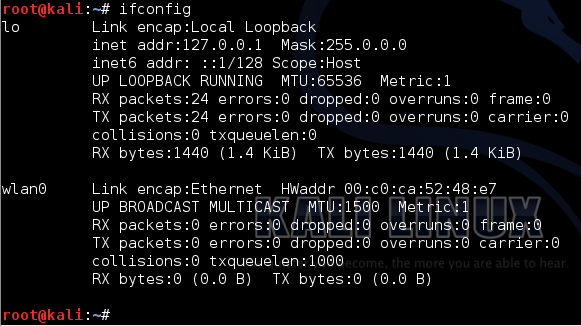
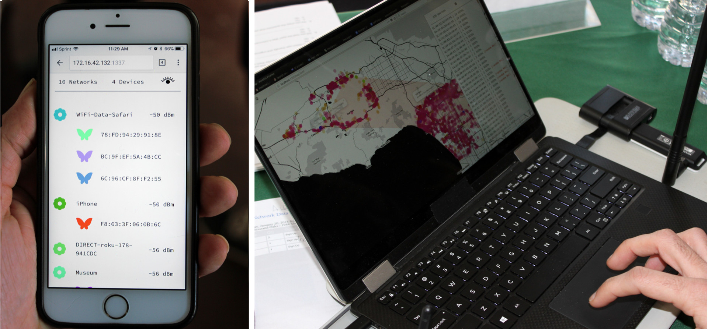
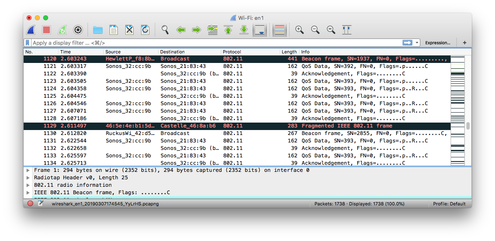
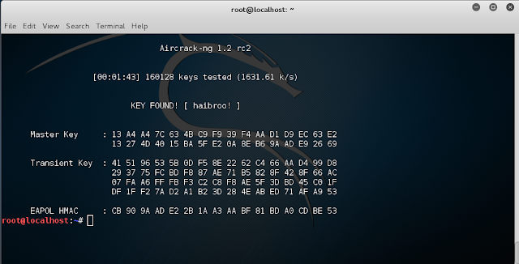

<!-- Ethical Hacking Module 02-->
<!-- by Phillip David Stearns 2019-->

# Ethical Hacking Module 3:


## Practical Attacks Against WiFi

This is the third installment of a series of ethical hacking courses for folks with non-technical backgrounds. Although, by this point, we've got a pretty decent technical background.

## What we’re covering today:

* WiFi Network Discovery
* Wireshark
* WPS Brute Force Attacks
* WPS Pixie Dust Attack
* WEP Attacks
* WPA Password Cracking


## What you can expect to take away

* Basic understanding of how WiFi protocols function
* How to find networks and test for vulnerabilities
* How to execute well known but effective attacks against WiFi networks
* How to crack WPA passwords offline
* How to configure a router to prevent attacks

## WiFi Network Discovery


Step one is finding the WiFi access points around us. We're using a pretty basic Panda PAU05 USB WiFi dongle. The antenna is built in and not very large, so our range isn't spectacular, but it's an effective short range dongle that doesn't draw attention to itself.

If you want to go shopping for an upgrade to your WiFi adapter, I'd recommend having a look a Alfa Networks line up. There are loads of reviews of Kali Linux WiFi adapter reviews like [this one](https://www.wifigeeks.org/best-usb-wifi-adapter-for-kali-linux/), or [this one](http://hackersgrid.com/2018/06/top-kali-wifi-adapters.html). I can personally vouch for the [Panda PAU05](https://www.ebay.com/itm/Panda-300Mbps-Wireless-N-USB-Adapter-w-WPS-button-802-11-n-2-4GHz/122010950775) (lucky you!), [TP-Link TL-WN722N]() (Version 1 only), and the [Alfa AWUS036ACH](https://www.amazon.com/Alfa-Long-Range-Dual-Band-Wireless-External/dp/B00VEEBOPG) (driver setup and compatibility with aircrack suite is tricky).

### Aircrack Suite

The [aircrack-ng suite](https://aircrack-ng.org/) is, in their words:
>
>a complete suite of tools to assess WiFi network security.
>
>It focuses on different areas of WiFi security:
>
>* Monitoring: Packet capture and export of data to text files for further processing by third party tools
>* Attacking: Replay attacks, deauthentication, fake access points and others via packet injection
>* Testing: Checking WiFi cards and driver capabilities (capture and injection)
>* Cracking: WEP and WPA PSK (WPA 1 and 2)
>
>All tools are command line which allows for heavy scripting.

One of the reasons we're using Kali rather than trying to turn our OSX machines into hacking beasts is that not all of the aircrack-ng tools are available for OSX, at least not without a lot of extra work compiling binaries from the source. If you want to take that on, checkout their [repository on GitHub](https://github.com/aircrack-ng/aircrack-ng).

Some of the tools that we'll be covering today include:

* **airmon-ng** - safely and quickly change WiFi adapters between monitor and managed modes
* **airodump-ng** - a utility to sniff WiFi packets for access points and wifi devices
* **aireplay-ng** - a tool that can perform various packet injection attacks that aid in WEP and WPA cracking
* **aicrack-ng** - an offline WEP and WPA brute force password cracking tool

### Monitor Mode with `airmon-ng`

Let's say we want to test our home network setup for any vulnerabilities. The first step would be to figure out if your network is visible to an attacker, and what they might be able to find out about who is connected to your network.

1. Fire up Kali if you haven't already.
2. Open the Terminal app.
3. Run the command, `ifconfig` and you should see something like this:



`wlan0` is your WiFi adapter. In Linux land the entries here are called devices. `lo` is your local host device. It's a virtual network device that lets applications send data to each other using network protocols. It's good for testing, but let's focus on `wlan0`.

If we want to "sniff" the airwaves for WiFi data packets, we need to put our adapter in monitor mode. There are a couple of ways to do this. We'll use `airmon-ng` because it's simple, quick, and safe.

1. Run `airmon-ng start wlan0`
2. Run `ifconfig` again and check out the results.
3. You should have a new device, `wlan0mon`, and `wlan0` if nowhere to be found.

### On the Airwaves



Before we zero in on access points (APs), I was to step back and give you the full overview of what's flying through the airwaves. With your WiFi adapter in monitor mode, you're basically intercepting signals broadcast openly into the ether. These include things like beacons, packets that APs and devices send out to advertise their presence and to solicit a response from a previously visited AP.

When your WiFi router is just sitting there idle, it's actually broadcasting packets periodically to let devices within range know that it's there. Even if your network is "invisible" it's still broadcasting, it's just zeroed out its name. These broadcast beacons can be collected in a process known as "war driving", in order to geolocate access points. It's known that [Google Street View has been collecting this data, and more](https://www.darkreading.com/risk-management/google-street-view-pursued-wardriving-by-design/d/d-id/1104110).

When your device is dissociated from a network, if WiFi is still enabled, it's sending out solicitation packets, asking if any networks it's previously connected to are in the area. This can (has been and likely is) used to track people. The creative studio (and friends of mine), Branger_Briz, made [WiFi Data Safari](https://brangerbriz.com/portfolio/wifi-data-safari) and [Probe Kit](http://probekit.brangerbriz.com/) to illustrate just how much data we leak into the world by leaving our WiFi enabled when in transit.

### Wireshark


To see the raw packets, we need have a few different options. In both Linux and Unix (OSX) `tcpdump` can be used to capture, display, and filter WiFi packets from the command line. Typically, `tcpdump` is used in conjunction with scripts or in the background to support other applications that are able to filter and sort through the vast amount of data that can be captured in particularly active locations.

Let's have a look at Wireshark, a powerful GUI tool that gives us the ability to sort, filter, and inspect packets comprehensively.

1. From the Terminal, run `wireshark`
2. When the application loads, look for the **Capture** section and select **wlan0mon**
3. Click the blue shark fin button in the upper left of the window


Every entry is a packet. Some are broadcast advertisements and solicitations, others are encryption handshakes, some contain data payloads. There's all sorts of stuff we can capture and Wireshark gives us the ability to reconstruct packet sequences to view data exchanged between devices as well as filter the packets to show only specific types between specific devices.

OK... We'll come back to Wireshark in a bit. Let's move on to our first attack.


---


# WiFi Attacks

Some of these attacks have to to with the hardware configurations, others have to do with vulnerabilities in the way WiFi security features are implemented. We'll have a look at some hardware based vulnerabilities that have *mostly* been mitigrated or removed in contemporary hardware.

## WPS Attacks


If I were an attacker, I'd go for the low hanging fruit, vulnerabilities that make attacks quick and easy to pull off. You might already know about WPS, or at the very least might recognize the logo from a button on your router.

WPS stands for WiFi Protected Setup. It was a protocol established for WiFi Protected Access (WPA) that enabled easy connection to a network based on an 8 digital pin. Supplying the correct PIN would allow access to the network. However, unless there are security measures in place, brute forcing the PIN is a trivial matter due to how the PIN is generated and how the protocol responds to a partially correct PIN. Full details can be found [here](goodies/viehboeck_wps.pdf).

The US Cyber Emergency Response Team (CERT) issued [a bulletin](https://www.us-cert.gov/ncas/alerts/TA12-006A) regarding WPS in 2012. If device manufacturers had immediately begun implementing secure default settings disabling WPS by default, the number of devices still vulnerable to this kind of attack would be a lot less. Today, most devices ship with WPS disabled, and those that don't employ some form of rate limiting.

### Safety First...

I shouldn't have to tell you at this point, but you shouldn't perform the following attacks on networks  you don't own or don't have permission to test.

That said, if you're going to go rogue, do so at your own peril, but please take some precautions to protect yourself and maintain anonymity:

1. Use a live system and make sure any persistent data is securely encrypted with a strong key.
2. Change your MAC address using `macchanger -r wlan0mon`.
3. Think before you press enter.

Using the following techniques, you can test whether your devices is vulnerable. If yours is and you can't disable WPS, then it's time to consider upgrading to a new router.

### Brute Force


This method is likely not going to work. But if it does, then you should probably fix that. The tools we need to pull this off are:

* `airmon-ng`
* `wash`
* `reaver`

1. If your WiFi device isn't already in **monitor mode**, run `airmon-ng start wlan0`
2. Next run `wash -i wlan0mon` and let it run for a minute or so
3. You should see the access point you want to test. Make note of it's **BSSID** and **channel**.
4. To start the brute force attack, run `reaver -vv -N -i wlan0mon -b 01:23:45:67:89:0F -c 11` and change the **BSSID** after `-b` and the **channel** after `-c` to suit your needs.

`reaver` randomly guesses the pin and keeps track of its progress, creating a unique session for each BSSID you attempt to crack. Chances are, you'll get in 3, maybe 5 guesses before `reaver` tells you that it detects rate limiting and will try again in 60 seconds. If you're patient and have no where to go for a few days, you can keep this up. Eventually you'll get through. Otherwise, you can setup a Raspberry Pi to run this attack while you go on with your life.

### Pixie Dust


Some chipsets are vulnerable to the Pixie Dust attack, which makes cracking the WPS pin a breeze. Provided you're close enough to the AP, within a few minutes, you should be able to crack the network keys.

1. Do steps 1-3 of the brute force instructions above.
2. Run `reaver -vv -N -i wlan0mon -b 01:23:45:67:89:0F -c 11 - Z`
3. If you're lucky, it'll find the PIN on the first try. Sometimes you have to try multiple times before you get a a good sense of whether your target is vulnerable.
4. If you do find the PIN, run `reaver -vv -N -i wlan0mon -b 01:23:45:67:89:0F -c 11 -p 12345678` and replace the number after `-p` with the PIN you found.
5. That should give you the WPA keys.

From my experience, certain chipsets and versions are more vulnerable than others. I've not gone through and made a comprehensive list, but generally, I find Broadcom to be pretty much resistant to Pixie Dust attacks, RalinkTech are fairly vulnerable, Realtek are sometimes vulnerable, and Atheros occasionally vulnerable.

### Remedies

As with many vulnerabilities, the best way to secure your device is to keep it updated.

* Check your device manufacturer for firmware updates regularly and install them when available.
* WPS attacks can be rendered ineffective by simply disabling WPS. Many older routers enabled WPS by default.
* If you're unable to disable WPS and you find that it's vulnerable, consider upgrading your hardware.

## WPA Attacks


### Offline Brute Force Password Cracking

When you connect to a WiFi access point with WPA/WPA2 personal security protocol, a sequence of packets is sent between the AP and your device to eastablish a secure connection. This is called the 4-way handshake. Researchers discovered a while back that this handshake is vulnerable to brute force hacking.  This means we can capture the handshake, and using the ESSID of the target network, brute force crack the password.

The attack involes using the key generating algorithm to create hashes of key candidates and then compare the hashes to those captured in the handshake.

A hashing algorithm is a one way translation of a digital file into a unique string of characters and numbers. This string has a much shorter length than the original, essentially creating a unique "finger print" for files, strings, or any digital sequence. 

### Capturing the 4-Way Handshake



1. Place your wireless device monitor mode `airmon-ng start wlan0`
2. Open wireshark by running `wireshark` in the terminal
3. Select `wlan0mon` from the list and click the **blue fin button**
4. We should be able to see traffic from all over, but we need to get a bit more selective.
5. Open a new tab in the terminal by pressing `control+shift+t`
6. Run `airodump-ng -i wlan0mon`
7. When you see the ESSID or name of your target, press `space` and copy the **channel** and **BSSID**
8. Press `control+c` to stop `airodump-ng`
9. Next run `airodump-ng -i wlan0mon -c <channel>` and replace `<channel>` with the channel of your target.
10. Go back into **wireshark** and in the **display filter** field, enter `eapol && wlan.addr==xx:xx:xx:xx:xx:xx` and replace xx:xx:xx:xx:xx:xx with the BSSID of your target.
11. Next, all you have to do is wait for someone to connect to your target network and you should see the keys appear.
12. Once you have the handshake, stop the capture by pressing the stop button.
13. Save the capture by clicking `File > Export Specified Packets`
14. Select a name and location, the choose `Wireshark/tcpdump/... - pcap` from the "save as" drop down menu.
15. Save!

### Cracking Dictionary Attacks



Wordlists are lists that are used to crack credentials. Kali comes with a standard wordlist called rockyou.txt. I don't have the full history on this file or how it came to be, but it has become an industry standard for testing the strength of passwords. There are ways to generate your own custom wordlists based on patterns you discover about your target. We'll cover how to do that with a tool called `crunch`.

We'll crack the 4-way handshake using `aircrack-ng`. First we need to do a little bit of preparation and then we'll get to it.

1. Run `gunzip /usr/share/wordlists/rockyou.txt.gz` to decompress the rockyou wordlist
2. Next run `aircrack-ng -a 2 -e <target ESSID> -b <target BSSID> -w </full/path/to/wordlist.txt> </full/path/to/handshake.pcap>`
3. If your wordlist contains the password, aircrack-ng will find it. If not, you have to get back to work and narrow down your keyspace based on good recon.

### Cracking with `crunch`

`crunch` can help you build custom wordlists that you can either direct to a .txt file or pipe directly into `aricrack-ng`. Here's an example of piping `crunch` into `aircrack-ng`:

```
crunch 8 8 -t %%%%%%%% | aircrack-ng -a 2 -e <target ESSID> -b <target BSSID> -w - </full/path/to/handshake.pcap>
```

## WEP Attacks

Though you might still find systems using WEP, it's so uncommon that we'll save this for future versions of this workshop where we have a bit more time.

## Module 04:

* **Network Discovery** - Host Discovery and Port Scanning