<!-- Ethical Hacking Module 02-->
<!-- by Phillip David Stearns 2019-->

# Ethical Hacking Module 4:

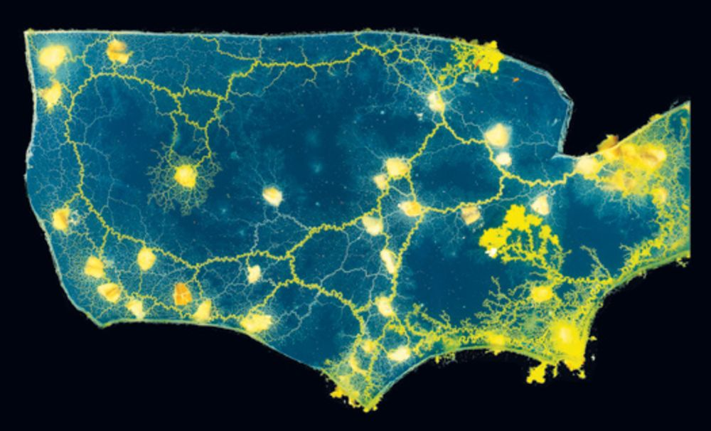

## Network Discovery

>Network discovery is the process through which computers and network devices are able to find each other. It enables network devices over a local network to connect and communicate with other devices.

This is the fourth installment of a series of ethical hacking courses for folks with non-technical backgrounds. Although, by this point, we've got a pretty decent technical background.

Whether we're a guest or an administrator, it's important to know what's on our networks. If we have a WiFi router in our homes, we should get comfortable with the idea of viewing ourselves as network administrators. In the previous module on WiFi security, we looked at a few ways that someone could get onto our network without our permission.

This module will equip you with the knowledge of how to find out what's on your network and what operating system and services are running on it. You can then determine if it should be there or not, or if there are services on your devices that might need to be shut down or have access restricted to them.

*As always, if you don't have permission to do these kinds of scans on your network or against a device, proceed at your own peril. Some of the scans are noisy and will draw attention, others are considered very intrusive. Activity like this may trigger "alarms" on properly monitored systems.*

## What we’re covering today:

There are several different approaches to identifying devices on your network. This workshop will offer an introductory glance to some of the basics, from `ping` and `arp` to `wireshark` and `nmap`.

* Networking Basics
* Host Discovery Methods
* Port Scanning
* Service Scanning


## What you can expect to take away

* Basic Understanding of how communication happens on networks
* Understanding what the ARP table is and what it's good for
* Know how to see who's on your network
* Find out what services are exposed on your network

## Networking Basics


Networking is all about connections. In network theory, we refer to objects in the network as *nodes*, and the relationships or connections between them are *edges*.

On a computer network, the nodes are the devices make up the network and the edges are communication paths or connections between them.

Here are some basic networking concepts we should be familiar with:

* Client & Server
* IP Addresses
* Hubs, Switches, Cables
* Routers, Firewalls

## Client & Server (Hosts)

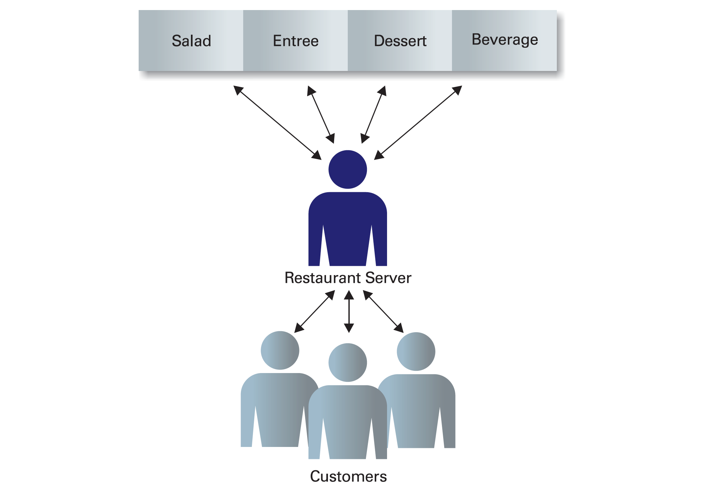

In the dining model, it's easy to identify the server and client. The server has the goods and serves them to clients based on their requests.

In a computer network, the relationships might not be so clear. Any resource that a device hosts, can become something that can be served to another device. Devices are typically referred to as hosts.

In our home networks, a resource like a printer might be connected to a desktop in the bedroom. When I want to print something from my laptop in the living room, the desktop in the bedroom acts as a server to give access to the printer to my laptop.

Dedicated servers allow for the centralization and management of a resource to a number of clients.

## IP Address

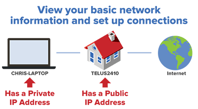

Communication between devices on a network is made possible by protocols that determine how messages are sent between them.

IP is the Internet Protocol, developed by Vint Cerf and Bob Kahn, first published by the Institute of Electrical and Electronic Engineers in May 1974. It defines addressing methods that allow devices to send data to each other, and describes how datagrams (packets) are relayed across network boundaries.

The IP Address is a unique identifier assigned to each device on a network.

IP Addresses come in two flavors: IPv4 and IPv6. We'll focus on IPv4 for this module.

### IPv4

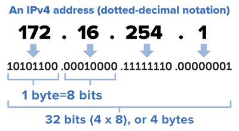

* 4 Octets
* 0.0.0.0 - 255.255.255.255
* Typical Local Network Blocks:
	* 10.0.0.0 - 10.255.255.255 or 10.0.0.0/8
	* 172.16.0.0 - 172.31.255.255 or 172.16.0.0/12
	* 192.168.0.0 - 192.168.0.255 or 192.168.0.0/16

Subnetting and Masking are beyond the scope of this workshop, but important topics when we're scanning different network topologies. [Learn more here](http://www.steves-internet-guide.com/subnetting-subnet-masks-explained/).

## Hubs, Switches, Cables

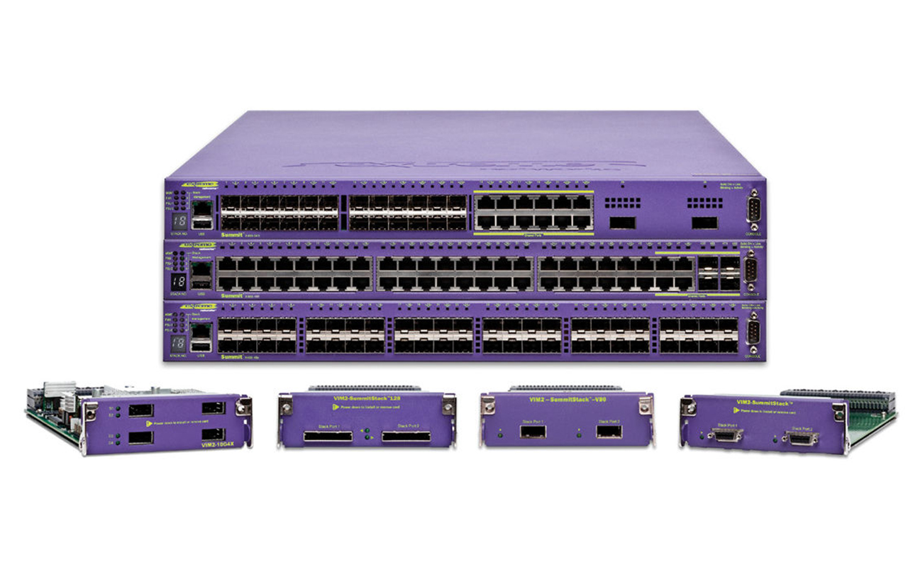

These are some of the physical components of a network that permit the flow of data through a network.

### Hubs

These are simple devices that allow the connection of multiple computers to a single network. Hubs don't route data, they allow for one-many broadcast of data within a network.

### Switches

Switches also allow the connection of multiple computers to a single network, but have several additional features:

* They switch packets, allowing for routing of packets between specific devices as opposed to broadcasting. This allows for parallel communication channels to occur simultaneously between different devices.
* Allow for packet filtering.
* Port Management
* Virtual LAN or VLAN management for network segmentation.


### Cables

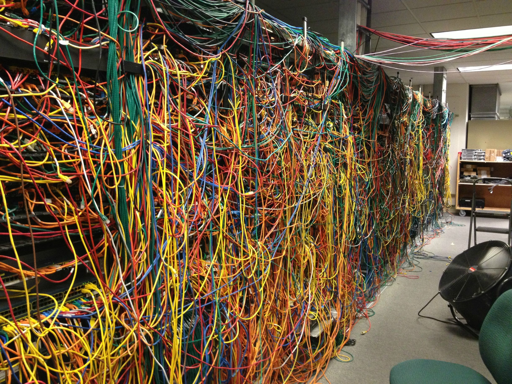

## Routers and Firewalls

Routers and Firewalls give a higher degree of control when it comes to managing the flow of data through a network.

### Routers

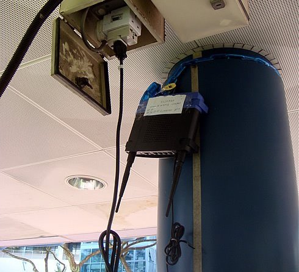

Responsible for the direction of data between our local network and the Internet.

### Firewalls


Allow us to set up specific rules governing traffic within our network and between others:

* Reachable services
* Reachable Devices
* Accepted Protocols
* Outbound Communication
* Inbound Communication

Firewalls can be deployed at different points in the network, as hardware devices or software running on devices.

## Host Discovery

How do we see what's on our network? There are a few tools are passive, and don't require us to transmit anything:

### `tcpdump`

Let's quick have a look at `tcpdump`.

1. run `tcpdump -A -vvv`

This will dump all received packets to the screen, displaying the payload data in ASCII format:

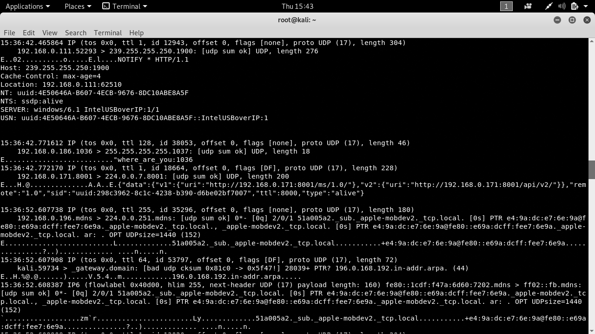

### `arp`

ARP is the Address Resolution Protocol. It is responsible for resolving IP addresses to specific devices using their Media Access Control or MAC address.

Devices store a table that is used to look up which device (MAC) is at which location (IP Address). In Unix and Linux systems, the `arp` command lets us view the contents of that table.

1. run `arp -h`
2. run `arp -env`

* `-e` - displays the linux style table
* `-v` - is verbose mode
* `-n` - displays numeric addresses

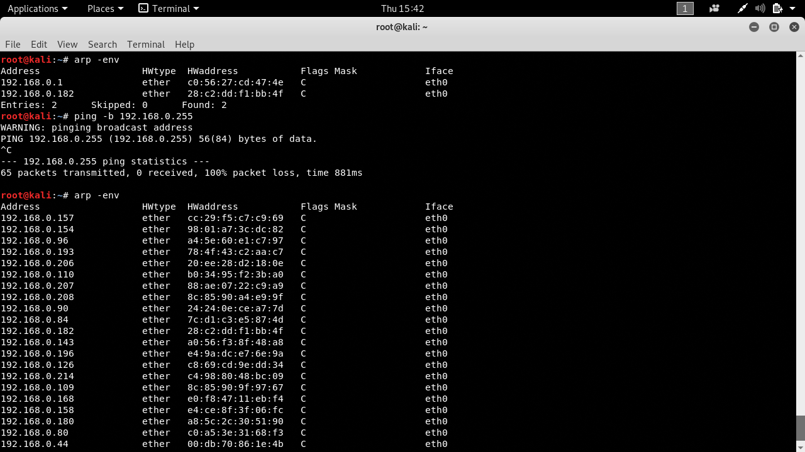

ARP requests and responses are commonly exchanged when devices join networks.

**NOTE:** It's fairly common to see routers asking for MAC addresses corresponding to IP Addresses but it's not common to see a single device asking for MAC addresses from an entire IP Address range or network block. This kind of behavior should be regarded as suspicious.

### `ping`

Now we're sending packets out into the network. `ping` is a call waiting for a response. When a devices receives a `ping` it's polite, but not required to reply.

Networks have a broadcast address that allows a device to send data to every device on the network. Generally it's the last available address in the network.

A `192.168.0.0/24` network has IP addresses `192.168.0.1-254` with `192.168.0.255` reserved for the broadcast address.

Let's see what happens when we ping the broadcast address of our network.

1. run `ping -b 192.168.0.255 -c 2`

* `-b` - ping the broadcast
* `-c <number>` - number of pings to send
* `-i <seconds>` - specify the interval in seconds between pings

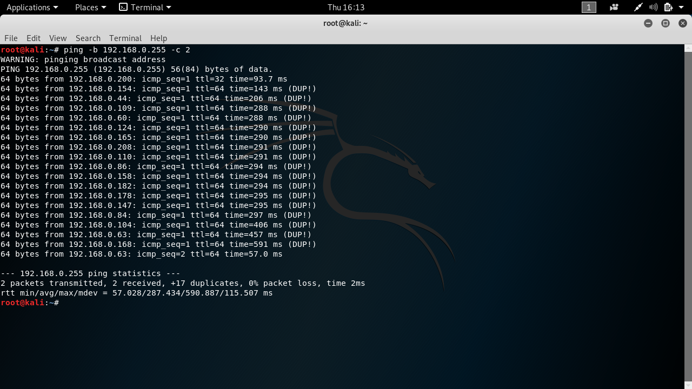

**NOTE:** This behavior is also regarded as suspicious.

### Creating a List of Targets

The process of systematically mapping all possibilities is call enumeration. We're enumerating all the devices or hosts on our network. We can now create a list of active hosts.

1. run `arp -env` again to have a look at our list of hosts.

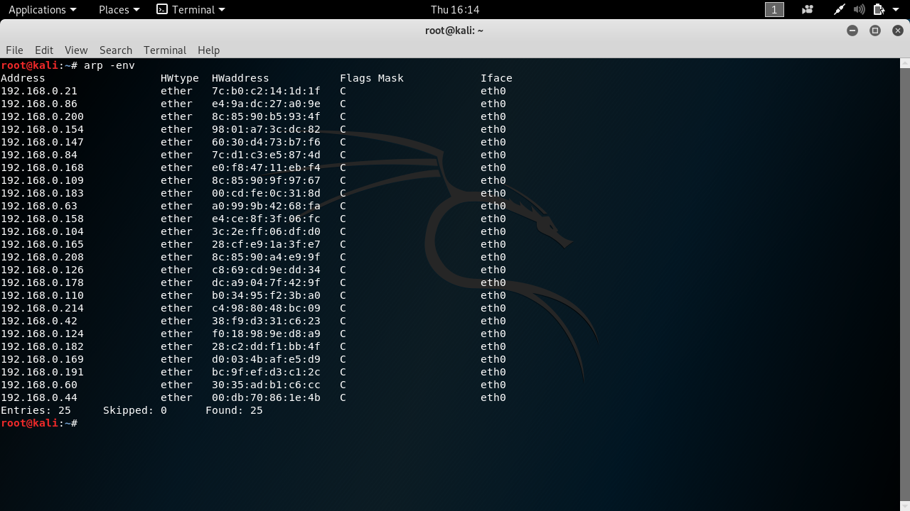

2. we can use `grep` to filter based on a regular expression using the form `grep -oE 'regEx'`. The full command we will run is:

```
arp -env | grep -oE '([0-9]{1,3}\.){3}[0-9]{1,3} > ~/hosts.lst'
``` 

* `arp -env` - outputs the ARP table
* `| grep -oE` - pipes the ARP table into `grep` which returns only the matched pattern specified by a regular expression:
* `'([0-9]{1,3}\.){3}[0-9]{1,3}'`
	* 	`(){3}` looking for three of the pattern in `()`
	*  followed by `[0-9]{1,3}`
	*  `[0-9]` matches the numbers 0-9
	*  `{1,3}` matches 1,2 or 3 of the preceding pattern
	*  `\.` matches `.`, `\` is an escape character we have to use for some punctuation marks in bash.
	*  Essentially this will match `0.0.0.0 - 999.999.999.999`
* `> ~/hosts.lst` directs the output of `grep` to the file "hosts.lst" in the current user's home directory 

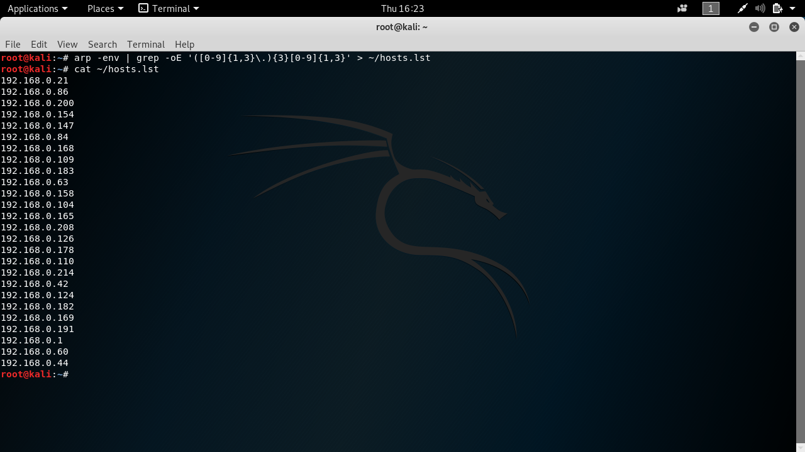

We've got some of the broadcast addresses in there. If we already know our subnet, the we can further restrict our hosts list to that range by changing the **regEx** in `grep`:

```
grep -oE '192\.168\.0\.[0-9]{1,3}'
```

## `nmap`

[](https://nmap.org/)

Nmap (Network Mapper) is the industry standard tool for network discovery. The project turned 20 years old in September of 2017 and is superbly documented. There are whole books dedicated to using nmap. In this module, we'll scratch the surface, introducing approaches to host discovery, basic port scanning, and service and OS scanning.

### Host Discovery in Nmap

#### Host Scan

Nmap can send ARP requests to an entire network segment or IP address block. Any device on the network will reply to an ARP request, unless configured to ignore from devices other than the router.

There are a couple of different ways to run this scan:

* `nmap -sn 192.168.0.0/24`
* `nmap -sP 192.168.0.0/24`  

Replace the network segment with a range: `192.168.0.1-254`

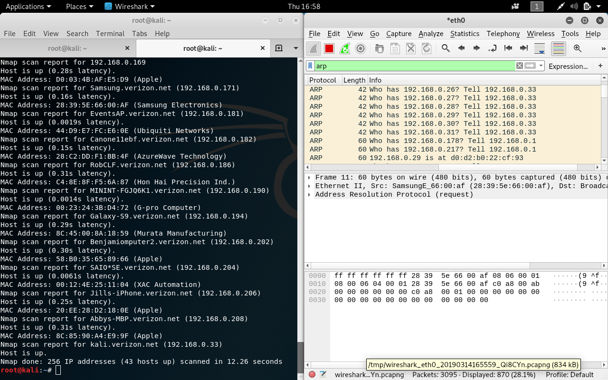

### Basic Port Scan

Ports are addresses where services on a host device can be accessed on a network. A common port on web servers is port 80 for HTTP. FTP can be reached on port 21.

Other ports can be opened for services belonging to applications running on the host. Port 0 is reserved but the range from 1-65535 covers all possible ports.

Nmap's vanilla scan will scan the top 1000 ports, assessing whether they're open or closed, filtered, unfiltered, open|filtered, closed|filtered. *For now, we're mostly interested in open ports.*

We can do a scan of the entire network segment:

```
nmap 192.168.0.0/24
```

Or deep scan on a single target:

```
nmap -p- 192.168.0.7
```
We can also scan targets in a list:

```
nmap -iL ~/hosts.lst
```

#### Specific Ports

* `nmap -p 80,21,23,25,443,445 192.168.0.1` - `-p` accepts specific ports we want to scan
* `nmap -p1-500 192.168.0.1` - scans ports 1-500
* `nmap -p telnet 192.168.0.1` - will scan the port associated with a known service. 

### Host Down?

* `nmap -Pn 192.168.0.1` - the `-Pn` option disables ping and assumes host is up.

### Specialty Scans

### Version

* `nmap -sV 192.168.0.1` - Will attempt to determine service version
* `nmap -sV -p telnet 192.168.0.1` - specific service
* `nmap -sV -p 80,23,433,139,631 192.168.0.1` - multiple ports/services

#### Operating System

* `nmap -O 192.168.0.1` - Operating System Detection

#### Aggressive Scan

* `nmap -A 192.168.0.1` - Aggressive scan that looks for common ports, attempts to determine version and operating system. VERY noisy and potentially time consuming if done on a large network segment

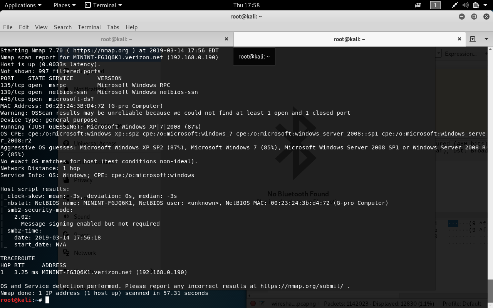

### Saving Output

* `-oX <filename.xml>` - save output to xml (useful for importing to metasploit later
* `-oN <filename.txt>` - save to a .txt file
* `-oA <filename>` - save all output formats

Example:

```
nmap -Pn -A -oX ~/megascan.xml 192.168.0.0/24
```

This will perform an aggressive scan on all potential hosts in `192.168.0.0-255` IP address block and output the results to `megascan.xml` in the home directory.

## Enumerate All the Machines!


Can you identify the different devices on our test network? Enumerate them all!

You should see:

* The router
* My Laptop
* 6 virtual machines
* Your fellow classmates

Create a comprehensive list of all that you can discover about the devices on our test network.

And Go!

## Resources

Jackpots

* [VulnHub](https://www.vulnhub.com/resources/)
* [Hackable Linux Distributions](https://security.stackexchange.com/questions/57950/hackable-linux-distributions)

Virtual Machines:

* [Rapid 7: Setting Up a Penetration Testing Lab](https://kb.help.rapid7.com/docs/setting-up-a-penetration-testing-lab)
* [My VirtualBox Penetration Testing Lab](https://blog.cobaltstrike.com/2011/11/04/my-virtualbox-penetration-testing-lab/)
* [VulnHub](https://www.vulnhub.com/)

Hackable Raspberry Pi Distribution

* [RasPwn OS](http://raspwn.org/)